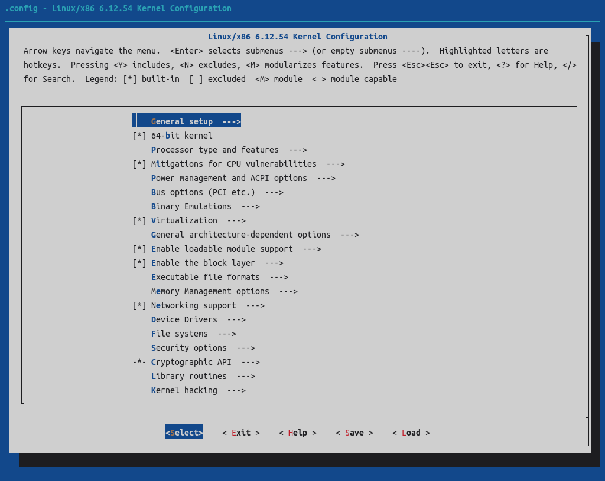

# Linux内核的编译
Linux是当今最著名的开源操作系统内核，更是当今信息时代的核心基础设施之一。Linux使用了GPLv2协议，但Linux并非GNU软件。部分人在故意混淆概念，还有部分人已经被混淆了。下面我将说明任何编译Linux。  

 
注意：本文章目前暂不涉及有关Linux Rust组件的编译。

## 前期准备

首先安装编译Linux所依赖的工具与开发库。
```sh
apt install gcc-14 make flex bison
apt install libncurses-dev libelf-dev libssl-dev
```

然后前往[Linux官网](https://www.kernel.org/)下载Linux源码包。Linux稳定版分为两类普通稳定版和长期支持版(LTS)，普通稳定版仅提供三个月左右的维护支持，而（新的）长期支持版则提供两年的维护支持。通常推荐使用LTS版。  

之后解压Linux源码包并进入项目目录。  
```sh
tar -xvf linux-VERSION.tar.xz
cd linux-VERSION
```

## 编译配置

附注：Linux的主要编译产物有两个，其一为裸内核，裸内核即最核心的内核部分其将会被引导程序引导启动。其二为内核模块，内核模块是许多相对独立的外置的模块文件，其将被裸内核加载，使用内核模块可避免将所有代码都编译进裸内核中令其体积过大，且能实现内核的解耦。在后文中笔者将会忽略裸内核的“裸”字，故在遇到“内核”一词时请读者根据语境自行确定含义为“内核”还是“裸内核”。

Linux的编译配置和其他的一些软件不太一样，因为Linux包含了各种各样的组件和驱动所以其配置自然也就无比繁多其复杂，故为了方便配置编译参数Linux提供了专门配置语言Kconfig和图形化配置工具。编译Linux需要通过配置工具生成编译配置文件后才能进行编译。  

Linux提供了多个图形化配置工具，但最常用的是menuconfig，其次是nconfig，启动menuconfig的命令如下:  
```sh
make menuconfig
```
然后等待menuconfig工具编译完毕后将会看到如下界面。
  
通过该工具可以调整各个配置项。有的项单纯链接到其子项配置页面，有的项仅能选择其是否勾选编译，还有的项既有编译勾选框也有指向子项页面的链接。  

方向键可用于上下移动焦点(focus)，空格键用于更改焦点项的编译状态，回车键用于进入子项页面，双击`ESC`可返回上一级页面。`/`键用于打开搜索菜单以搜索特定配置的页面路径。

具有编译勾选框的项可能有两种或三种编译勾选状态，括号内容为空` `表示不编译(remove)，`*`表示编译进（裸）内核(built in)，`M`表示编译为内核模块(modularized)。还有，勾选框分为了三类，勾选框可能是一对方括号`[ ]`，也可能是一对尖括号`< >`还可能是一对花括号`{ }`，这三种勾选框允许的编译勾选状态存在些许区别，其具体的说明如下:  

`[ ]` 不编译或编译进内核  
`< >` 不编译、编译进内核或编译为内核模块  
`{ }` 编译进内核或编译为内核模块或被其他功能选择  
`_ _` 被其他功能选择（这类编译勾选项用户无法直接更改，所以上文没有提及）

还有一点要注意：有的配置项之间存在依赖关系，有的依赖要求不满足要手动找到其依赖项并勾选然后才能勾选目标项（配置工具不会帮你自动勾选依赖）。有的配置项之间还存在互斥关系，要取消勾选对应互斥项才能勾选目标项。  

你问我这各个配置项都是干吗用的？这玩意可太多东西了，我不想说。但既然你要编译Linux内核那你也应当有了基本的计算机专业知识基础和简单的英语基础以及部分计算机专业英语词汇储备。哪部分配置项的用途你也应该能看得懂了。随着你对Linux内核的了解的加深和计算机专业知识储备的增加你能看得懂的配置项将会越来越多。  

在配置完你要调整的配置项后按`TAB`键将焦点移动到`< Save >`上然后回车`< Ok >`即可保存编译配置文件。返回主界面后再双击`ESC`即可关闭menuconfig。  

## 编译Linux内核
下面列出编译Linux内核的常用命令。
```sh
# 编译内核和内核模块
make -j$(nproc)
# 仅编译内核
make bzImage -j$(nproc)
# 仅编译内核模块
make modules -j$(nproc)
```
说明：`-jN`参数用于说明使用N个CPU物理线程进行编译，`nproc`命令用于获取CPU的总物理线程数，故`-j$(nproc)`参数用于使用所有CPU物理线程进行编译。  

注：`make help`命令可用于查看编译Linux相关的帮助信息。  

## 安装Linux内核

### 安装裸内核
Linux内核文件通常的路径为`arch/TARGET_ARCH/boot/bzImage`。但对于x86_64架构的内核其路径`arch/x86_64/boot/bzImage`的文件是一个软链接，链接到了`arch/x86/boot/bzImage`。即x86_64架构内核的实际输出路径为`arch/x86/boot/bzImage`（我也不知道它为什么这么设置）。

下面的命令用于为当前系统安装内核。  
```sh
make install
```

如果要为其他机器安装内核，将`bzImage`复制到目标机器的内核存放目录即可（通常为目标机器的: `/boot`）。通常还应该将`.config`和`System.map`一并复制过去。  

### 安装内核模块
下面的命令用于为当前系统安装内核模块。  
```sh
make modules_install INSTALL_MOD_STRIP=1
```
说明：`bzImage`默认剥离调试符号信息，但内核模块默认不剥离调试符号信息。保留调试符号信息将会大大增加程序文件的体积（保留调试符号的文件体积是不保留调试符号文件的体积的数倍）。所以为了减少程序的体积通常都会剥离调试符号，除非你要进行调试工作。而`INSTALL_MOD_STRIP=1`参数用于指明在安装的过程中剥离调试符号。

如果要为其他机器安装Linux内核模块则执行以下命令。  
```sh
make modules_install INSTALL_MOD_STRIP=1 INSTALL_MOD_PATH=/PATH/TO/ROOTDIR
```
说明：`INSTALL_MOD_PATH`参数用于指定内核模块安装路径（通常是目标机器的根目录），其默认值为`/`。  

### 安装Linux内核头文件
安装Linux内核头文件的命令如下:  
```sh
make headers_install
```
该命令有两个可选的参数。`INSTALL_HDR_PATH`用于指定安装路径（示例: `INSTALL_HDR_PATH=/usr`），其默认值为`./usr`。`ARCH`参数用于指定目标机器的架构（示例: `ARCH=i386`），其默认值为当前架构。

## 清理工作
清理编译目录的命令如下:  
```sh
make clean
# or
make distclean
```
说明：`clean`将删除编译过程产生的文件，`distclean`则进行更彻底的清理（其将删除编译配置文件）。  

## 参考资料
\[1\] [How to quickly build a trimmed Linux kernel](https://www.kernel.org/doc/html/latest/admin-guide/quickly-build-trimmed-linux.html)  
\[2\] nconfig help  
\[3\] make help  
\[4\] Documentation/kbuild/kbuild.rst  
\[5\] [System.map文件的作用解析](https://www.cnblogs.com/linuxprobe-sarah/p/10435220.html)  
\[6\] [Exporting kernel headers for use by userspace](https://docs.kernel.org/kbuild/headers_install.html)  

---
Author: smgdream | License: CC BY-NC-SA 4.0 | Version: 0.7 | Date: 2025-10-24