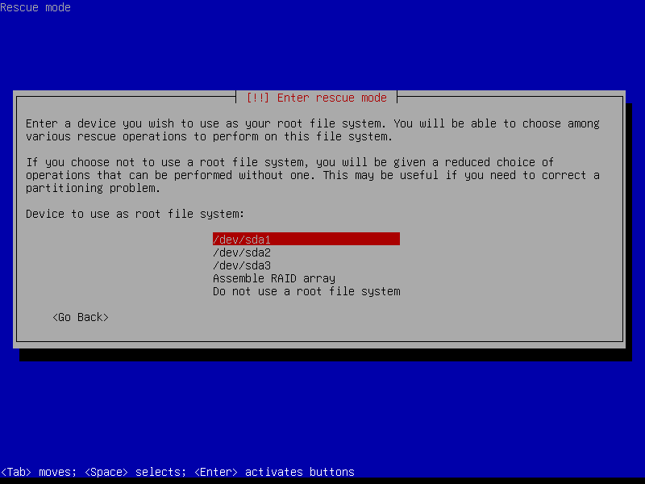
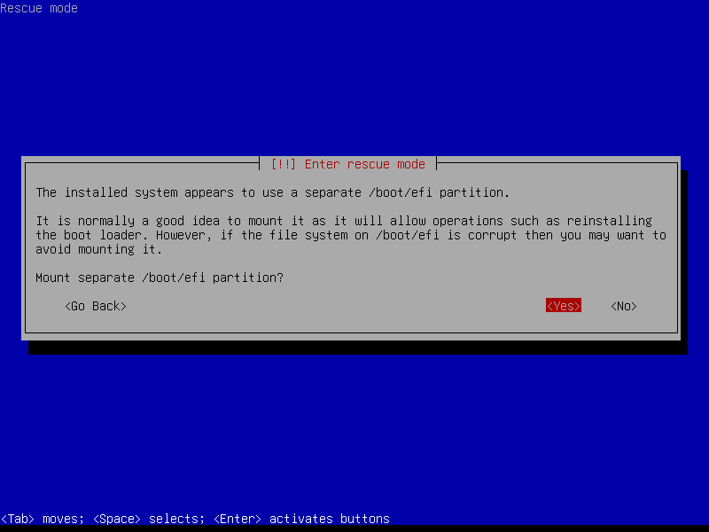

# Debian To Go

**注意：** 安装debian to go方法相对复杂，对用户的Linux功底有一定要求。

Debian to go即为装在u盘（移动存储）设备里的Debian系统，主打一个说走就走即插即用。Debian to go的安装方式和正常安装大同小异，但要做一些额外操作。

存储设备要求：推荐使用移动固态存储设备，最低要求顺序读写>=50MiB/s且4K Write>=2MiB/s的高速USB3.0存储设备。

## 安装Debian to go要注意的点

按照正常的步骤来[安装Debian](../start/install-deb.md)即可。  

注意：到了执行安装grub启动引导器步骤。该步骤会破坏计算机上原本的grub引导（如果有的话）。而且引导也并非如我们所愿安装到u盘中，所以安装完debian后需要额外的引导修复。

## 引导修复

**U盘GRUB引导修复**  

安装Debian to go时安装程序往往会把引导安装到本地磁盘上，但这并非我们所要的效果。所以我们要重新安装引导。 

首先在计算机启动时启动到Debian安装介质，然后进入高级选项中的急救模式。之后前面几步正常安装系统别无二致。后面将会询问用户将那个分区设备挂载为根目录，此时选择U盘中根文件系统对应的分区设备。  
   
而后安装程序将询问是否挂载/boot/efi分区，选择“否”。  
  
然后选择在对应根分区设备中运行shell的选项。  
然后通过以下命令挂载efi分区。  
```sh
mount /dev/EFI_PART_DEV_NAME /boot/efi
```
然后通过以下命令为Debian to go安装grub
```sh
grub-install --target=x86_64-efi --root-directory=/ --efi-directory=/boot/efi /dev/USB_DISK_DEV_NAME --removable
```
然后通过命令`blkid -s UUID`查看EFI分区的UUID并且记下来。然后通过`vim.tiny /etc/fstab`命令编辑fstab配置文件，将EFI分区对应的UUID值更改为刚刚记下的UUID（注：UUID区分大小写），然后保存退出。之后通过以下命令卸载EFI分区。  
```sh
umount /dev/EFI_PART_DEV_NAME
```
然后退出当前shell并“重新启动系统”。  

如果本地硬盘中没有安装Linux系统则启动计算机，进入windows通过DiskGenius磁盘管理软件将本地磁盘EFI分区的中的EFI文件夹下的boot文件夹和debian文件夹删除。  

如果本地磁盘安装了Linux系统，则在安装Debian to go时其引导已被破坏，需按照以下方法重新安装grub引导。  

**本地grub修复**  

启动计算机启动到Debian安装介质并重新进入急救模式。当来到根分区设备选择界面时选择Linux系统所在分区（如果存在多个linux系统则选择其中一个合适的即可），然后当询问是否挂载/boot/efi对应分区时选择“是”。然后选择重新安装grub引导器，之后在对应界面中按照提示输入需安装grub引导器的设备的路径，然后即可完成grub的安装。最后，“重新启动系统”完成安装。

## 安装固件

Debian安装程序只会安装Debian在该计算机运行所需固件，而Debian to go可能需要在多个机器上运行，为了让其可以在多个机器上运行所有常用固件应装尽装（部分特殊情况的除外）。  
首先，要挂载安装介质并设为软件源。先插入安装介质，通过以下命令挂载安装介质。  
```sh
mkdir /mnt/install
mount /dev/INSTALL_MEDIA_PART_DEV_NAME /mnt/install
```
然后，将/etc/apt/source.list和/etc/apt/source.list.d/*删除。之后新建文本文件/etc/apt/source.list并在其中写入以下内容：  
```
deb [trusted=yes check-valid-until=no] file:///mnt/install/ trixie contrib main non-free non-free-firmware
```
然后通过命令`apt update`更新软件源，之后通过以下命令安装常用固件：  
```sh
apt install \
	firmware-amd-graphics \
	firmware-ast \
	firmware-ath9k-htc \
	firmware-atheros \
	firmware-bnx2 \
	firmware-bnx2x \
	firmware-brcm80211 \
	firmware-carl9170 \
	firmware-cavium \
	firmware-cirrus \
	firmware-intel-graphics \
	firmware-intel-misc \
	firmware-intel-sound \
	firmware-ipw2x00 \
	firmware-ivtv \
	firmware-iwlwifi \
	firmware-libertas \
	firmware-linux-free \
	firmware-linux-nonfree \
	firmware-linux \
	firmware-marvell-prestera \
	firmware-mediatek \
	firmware-misc-nonfree \
	firmware-myricom \
	firmware-netronome \
	firmware-netxen \
	firmware-nvidia-graphics \
	firmware-qlogic \
	firmware-realtek \
	firmware-siano \
	firmware-sof-signed \
	firmware-zd1211
```
注：以上固件名单通过在live版执行`apt list firmware-*`命令获得。

此时固件已经安装完毕，接下来是收尾工作。  
将前不久添加的安装媒介的软件源配置内容注释掉，然后通过`umount /dev/INSTALL_MEDIA_PART_DEV_NAME`命令卸载安装介质，最后通过命令`rm -r /mnt/install`删除已经无用的挂载目录。  

**自此Debian To Go的安装才算真正完成。**  

---
Autuor: smgdream | License: CC BY-NC-SA 4.0 | Version: 0.6.6 | Date: 2025-10-10