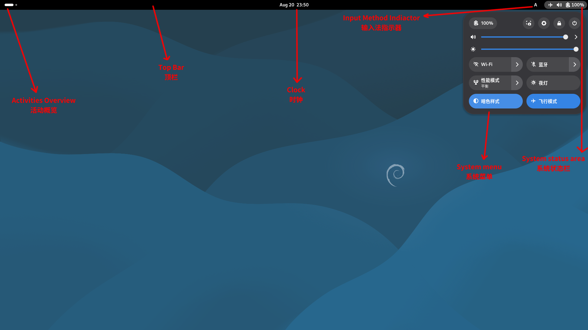

# Gnome的调教与美化

Gnome是两大linux桌面环境之一，它设计简洁对许多新的桌面图形特性支持良好。其对于键鼠操控和触屏操控都很友善。唯一美中不足的是为了获得更加良好的交互体验需要依赖于第三方开发的扩展。下面分别介绍gnome-tweak的使用、扩展的安装和Gnome美化，然后还将额外介绍一下Gnome-shell界面的构成。  

## Gnome Tweaks
Gnome Tweaks用于设置于Gnome图形界面相关的高级内容，如：主题、样式、字体、窗口等等等等。  
  
通常Debian Gnome默认安装了gnome-tweaks，如果没有安装则可以通过`apt install gnome-tweaks`命令进行安装。  

**显示最大化最小化按钮**  
Gnome默认不显示窗口的最大化最小化按钮，许多用户依赖于有最大化最小化按钮的窗口操作方式，而显示最大化最小化按钮的方法如下：  

在Gnome Tweaks的“窗口”菜单中打开标题栏按钮部分的最大化最小化开关即可显示最大化最小化按钮。  

## Gnome拓展安装和拓展推荐

如果要安装gnome扩展首先需要安装`gnome-shell-extensions`该软件用于管理和设置扩展，安装后可通过“扩展”应用管理gnome扩展。  
```sh
apt install gnome-shell-extensions
```
然后再安装常用扩展包`gnome-shell-extensions-extra`该拓展包中包含了数个常用扩展。  
```sh
apt install gnome-shell-extensions-extra
```
gnome-shell-extensions-extra包含的扩展如下：
| 扩展名称 | 包名 | 描述 |
| --- | --- | --- |
| Disable Workspace Switcher | gnome-shell-extension-disable-workspace-switcher | 隐藏切换工作区时出现的指示器 |
| Hibernate Status Button | gnome-shell-extension-hibernate-status | 在状态栏窗口显示休眠和混合挂起按钮 |
| Just Perfection | gnome-shell-extension-just-perfection | 改变gnome行为和隐藏UI元素 |
| Quick Close in Overview | gnome-shell-extension-middleclickclose | 在Overview中中键单击窗口即关闭窗口 |
| No overview at start-up | gnome-shell-extension-no-overview | 进入gnome时不显示Overview |
| V-Shell | gnome-shell-extension-vertical-workspaces | 垂直的工作区布局 |

<br>

之后还要安装"User Theme"（用户主题）扩展，因为不安装该扩展无法使用第三方主题。其安装命令如下。
```sh
apt install gnome-shell-extension-user-theme
```
注解1：Debian源中提供了部分常用扩展（但可能不是最新版本），对于源中没提供的扩展则要通过Gnome扩展商店安装或手动下载安装。  
注解2：安装完扩展后如果“扩展”应用没有显示扩展则需要重新登出再登录桌面环境或重启计算机。  
  
**类任务栏拓展**  

Gnome原生提供了类似任务栏的组件"Dash"但是它默认不会出现在界面上而要点击界面右上角的按钮进入action界面才会出现，要进入应用菜单还要在此界面再点击"Dash"的应用抽屉按钮，操作起来相当别扭。所以安装一个能将"Dash"钉在gnome界面上的类任务栏拓展就显得十分必要了。  

最常用的类任务栏拓展有两个，分别是Dash to Dock和Dash to Panel。  

**Dash to Dock**  
  
  
Dash to Dock用户最常用的Dash风格为Mac风格和Ubuntu风格，无论是那种风格都显得简洁而优雅。其安装命令如下：  
```sh
apt install gnome-shell-extension-dashtodock
```
**Dash to Panel**  
  
Dash to Panel默认的顶栏Dash二合一风格为gnome用户提供了类似于Windows的任务栏体验。其安装命令如下：  
```sh
apt install gnome-shell-extension-dash-to-panel
```
**托盘图标**  
托盘图标自Gnome3起被移除了，但是有不少应用的使用依赖于托盘图标，所以要通过`status icons`扩展来将托盘图标添加回来。其安装命令如下：  

```sh
apt install gnome-shell-extension-status-icons
```

**gnome界面透明化**  
将gnome界面透明化可以获得相当舒适视觉体验，而`Blur my shell`扩展提供了强大且全面的gnome界面透明化支持，他提供了许多透明化设置选项（这也导致了其设置稍微有点复杂）。
  
  
其安装命令如下：  
```sh
apt install gnome-shell-extension-blur-my-shell
```
注：通过apt安装的Blur my shell版本为67（可以在Gnome48上用），而68（当前的最新版本）才正式支持Gnome48，而68版提供了完整的中文设置界面支持。但需要去扩展商店安装或手动安装。

**其他扩展推荐**  
| 扩展名称 | 是否在Debian源中 | 描述 |
| --- | --- | --- |
| [Net speed Simplified](https://extensions.gnome.org/extension/3724/net-speed-simplified/) | 否 | 在顶栏显示当前网速及开机后总使用流量 |
| [Lunar Calendar 农历](https://extensions.gnome.org/extension/675/lunar-calendar/) | 否 | 在顶栏时钟及时钟菜单中显示农历 |

### 浏览器安装Gnome扩展
Debian的源中只提供了一小部分常用Gnome扩展，如果需要安装其他扩展则需要通过Gnome扩展商店安装。方法如下：  
首先安装`gnome-browser-connector`用以与浏览器对接，安装命令如下：  
```sh
apt install gnome-browser-connector
```
然后打开火狐浏览器安装["GNOME Shell integration"扩展](https://addons.mozilla.org/firefox/addon/gnome-shell-integration/)。之后，即可打开[GNOME Shell Extensions扩展商店](https://extensions.gnome.org/)搜索并安装扩展。  

在扩展页面开启右上角的开关（如果还出现了弹窗则同意）即可。  


### 手动安装扩展

在部分环境下无法在线通过GNOME Shell Extensions扩展商店安装扩展或想为系统安装扩展这种情况下则需要手动安装扩展。方法如下：  

从[GNOME Shell Extensions扩展商店](https://extensions.gnome.org/)下载扩展zip包或从扩展的独立发布页（如：github仓库页面）下载扩展zip包。然后解压zip包的内容解压到一个单独的空文件夹中（如：extmp）。  

之后查看文件夹内的metadata.json文件的uuid字段的字符串内容，然后将文件夹命名为该字符串内容（不要双引号）（如：uuid行的内容为`"uuid": "blur-my-shell@aunetx",`，则将文件夹命名为blur-my-shell@aunetx），如果文件夹中存在schemas子文件夹则要进入schemas子文件夹通过`glib-compile-schemas .`命令编译文件夹内的xml文件。  

之后将刚才命名好的整个扩展文件夹复制到用户gnome扩展目录`~/.local/share/gnome-shell/extensions/`或系统gnome扩展目录`/usr/share/gnome-shell/extensions/`。  

最后，重新登录Gnome或重启计算机后即可在“扩展”应用中启用扩展。  

以下是gnome扩展zip包自动安装脚本：  
```sh
#! /bin/bash

GNOME_EXT_DIR=/usr/share/gnome-shell/extensions

ZIP_FILE=$1

mkdir -v extmp
sleep 0.1s
unzip ${ZIP_FILE} -d ./extmp
if [ -d ./extmp/schemas ]; then
	echo "glib-compile-schemas ./extmp/schemas/"
	glib-compile-schemas ./extmp/schemas/
fi

EXT_UUID=$(cat ./extmp/metadata.json | grep "uuid" | sed -e 's/.*"uuid":."//g' | sed -e 's/",//')
echo extention uuid: ${EXT_UUID}

echo "moved ./extmp -> ${GNOME_EXT_DIR}/${EXT_UUID}"
sudo mv  ./extmp ${GNOME_EXT_DIR}/${EXT_UUID}

exit
```
使用方法：`./script.sh GNOMEEXT_ZIP_FILE`

## Gnome美化
在gnome tweaks的“外观”菜单中可以更改主题、图标和光标。  
  

### 安装Gnome主题

安装主题可以使得各种gtk应用具有相对一致（以及可能优雅）的视觉效果。  

可在独立主题发布页（如：github仓库页面）或[GTK3/4 Themes - Gnome-look.org](https://www.gnome-look.org/browse?cat=135&ord=latest)下载主题压缩文件。  

注：部分主题的安装需要`sassc`，可通过命令`apt install sassc`安装。  

然后解压文件。如果主题文件夹内提供了安装脚本则可以直接使用安装脚本安装主题。如果没有提供安装脚本则要将主题文件夹复制到主题目录（系统Gnome主题目录：`/usr/share/themes`，用户Gnome主题目录：`~/.themes`）。  

注意：部分下载下来的主题压缩档可能不单是一个主题而是一个系列的风格相似颜色不同的主题，其中包含了多个主题文件夹，需要复制的是主题文件夹（主题文件夹的判别方法：主题目录下直接存放着`index.theme`文件）。如果将整个系列的总文件夹复制过去将导致无法使用这些主题。笔者建议将系列所有主题文件夹全部复制到主题目录中。  

**Gnome主题推荐**  
| 主题名 | 描述 |
| --- | --- |
| [Orchis theme](https://github.com/vinceliuice/Orchis-theme) | 长期霸榜的主题，该主题现代优雅简洁细节也打磨得很好。该主题的设计较为圆润 |
| [Fluent theme](https://github.com/vinceliuice/Fluent-gtk-theme) | 长期上榜的主题，该主题设计语言较为方正，整个主题的设计亦现代简洁优雅 |

### 安装Gnome光标主题

安装光标主题可以改变光标的样式。

可在独立主题发布页（如：github仓库页面）或[Cursors - Gnome-look.org](https://www.gnome-look.org/browse?cat=107&ord=latest)下载光标主题压缩文件。  
然后解压文件。如果光标主题文件夹内提供了安装脚本则可以直接使用安装脚本安装光标主题。如果没有提供安装脚本则要将光标主题文件夹复制到光标主题目录（系统Gnome光标主题目录：`/usr/share/icons/`，用户Gnome光标主题目录：`~/.local/share/icons/`）。  

注意：部分下载下来的光标主题压缩档可能不单是一个光标主题而是一个系列的风格相似颜色不同的光标主题，其中包含了多个光标主题文件夹，需要复制的是光标主题文件夹（光标主题文件夹的判别方法：光标主题目录下直接存放着`cursor.theme`文件）。如果将整个系列的总文件夹复制过去将导致无法使用这些光标主题。笔者建议将系列所有光标主题文件夹全部复制到光标主题目录中。  

**光标主题推荐**  
| 主题名 | 描述 |
| --- | --- |
| [Bibata Cursor](https://github.com/ful1e5/Bibata_Cursor) | 该光标主题设计圆润现代，其黑白二色子主题最为出名，Manjaro默认即使用该光标主题 |

### 安装Gnome图标主题
安装图标主题可以覆盖已有应用的图标还可以覆盖gtk图标。  
可在独立主题发布页（如：github仓库页面）或[Full Icon Themes - Gnome-look.org](https://www.gnome-look.org/browse?cat=132&ord=latest)下载图标主题压缩文件。  

然后解压文件。如果图标主题文件夹内提供了安装脚本则可以直接使用安装脚本安装图标主题。如果没有提供安装脚本则要将图标主题文件夹复制到图标主题目录（系统Gnome图标主题目录：`/usr/share/icons/`，用户Gnome图标主题目录：`~/.local/share/icons/`）。  

注意：部分下载下来的图标主题压缩档可能不单是一个图标主题而是一个系列的风格相似颜色不同的图标主题，其中包含了多个图标主题文件夹，需要复制的是图标主题文件夹（图标主题文件夹的判别方法：图标主题目录下直接存放着`index.theme`文件）。如果将整个系列的总文件夹复制过去将导致无法使用这些图标主题。笔者建议将系列所有图标主题文件夹全部复制到图标主题目录中。  

## Gnome-shell界面构成



注1：System menu亦被称为System status menu（系统状态菜单）或Quick Settings（快速设置）。  
注2：Activities Overview有时会被简称为Overview（概览）或Activities。

## 参考资料

\[1\] [GNOME browser integration - Installation guide](https://gnome.pages.gitlab.gnome.org/gnome-browser-integration/pages/installation-guide.html)  
\[2\] [从 ZIP 文件手动安装 GNOME 扩展 ](https://cn.linux-terminal.com/?p=7822)  
\[3\] [glib-compile-schemas(1) — Arch manual pages](https://man.archlinux.org/man/core/glib2/glib-compile-schemas.1.en)  
\[4\] [Cursor themes - ArchWiki](https://wiki.archlinux.org/title/Cursor_themes)  
\[5\] [Icons - ArchWiki](https://wiki.archlinux.org/title/Icons)  
\[6\] [Projects/GnomeShell/Design – GNOME Wiki Archive](https://wiki.gnome.org/Projects/GnomeShell/Design)  
\[7\] [Teams / Design / os-mockups · GitLab](https://gitlab.gnome.org/Teams/Design/os-mockups)  
\[8\] [Red Hat Enterprise Linux 9 Getting started with the GNOME desktop environment](https://docs.redhat.com/en/documentation/red_hat_enterprise_linux/9/pdf/getting_started_with_the_gnome_desktop_environment/Red_Hat_Enterprise_Linux-9-Getting_started_with_the_GNOME_desktop_environment-en-US.pdf)

---
Author: smgdream | License: CC BY-NC-SA 4.0 | Version: 0.7.3 | Date: 2025-10-12
