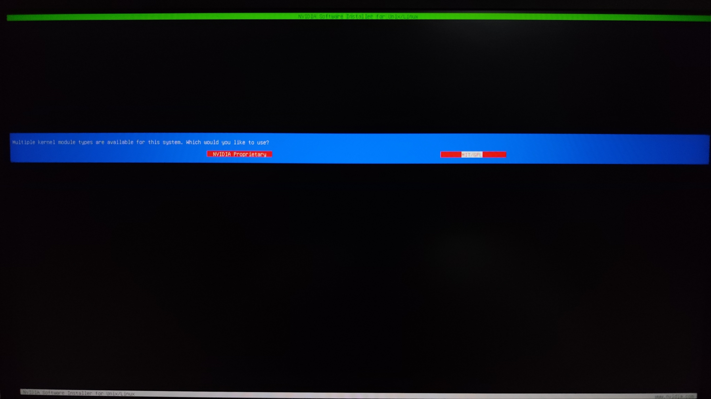
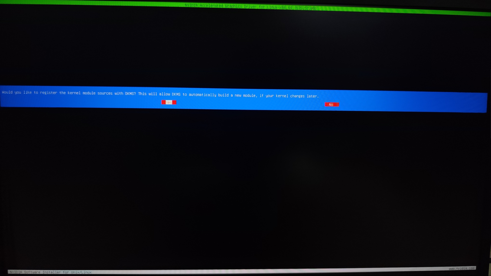
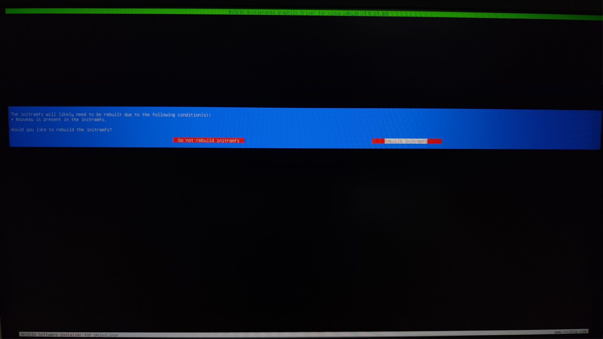
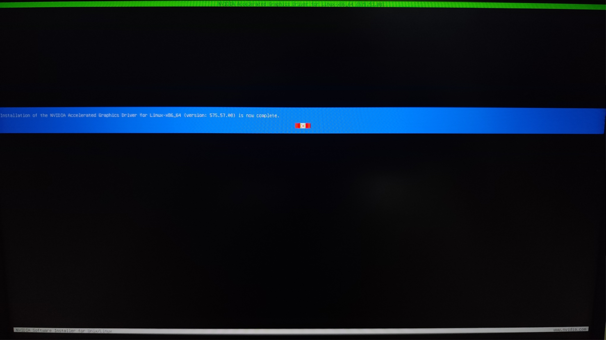

# Deal late no more NVIDIA （NVIDIA驱动的安装和配置）

  
此时无声胜有声  

现在，这个名场面已经过去10年了，nvidia对linux的支持也好了很多，而且现在nvidia也把内核驱动开源了。而对于Debian来说nvidia的独显驱动支持也是三家中最好的。但nvidia仍是三家中最封闭的显卡公司，毕竟开源驱动都是逆向出来的，目前也只能当亮机驱动用，所以说“经典永不过时”。下面分别说明安装官方驱动的方法和通过apt安装nvidia驱动的方法（注意：nvidia驱动的安装比较特殊，建议看完对应安装方法后再进行驱动的安装）。  

**特别说明：** 以下安装方法假设你已经禁用计算机的安全启动，如果未禁用可参照[安装Debian](../start/install-deb.md)中“关闭安全启动和TPM”的方法关闭安全启动。如果你实在不肯关闭安全启动，驱动的安装过程将多出一些额外步骤，具体安装方法请上网自行查找。  

## 安装官方驱动

安装官方驱动可以及时支持新的显卡以及体验新的图形特性。Debian Wiki不建议用户安装nvidia的官方驱动说是可能会存在不兼容问题。但依据我的实际经验来看安装官方驱动是完全没问题的，笔者使用的就是官方驱动（我遇到的唯一一次问题是有一次内核小版本更新后驱动在新内核上编译出错，回到老内核就可以了。而且很快就有大佬提供了解决方案（要改几行代码），然后没过多久nvidia也发布了小版本驱动更新，在新驱动在新内核上就没有安装编译报错了）。官方nvidia驱动的安装方式如下：  

从[nvidia驱动下载页面](https://www.nvidia.com/en-us/drivers/)选择适用于当前机器显卡的较新<sup>注1</sup>驱动并下载。然后登出图形界面并停止显示管理器（如：对于使用gdm3作为显示管理器的用户，可通过`systemctl stop gdm3`命令结束显示管理器）。之后执行以下命令安装依赖工具、依赖文件、依赖库和DKMS框架。  
```sh
apt install build-essential linux-headers-$(uname -r | sed 's/.*-//g') pkg-config libglvnd-dev dkms
```
注：DKMS框架用于在内核更新时自动构建新的驱动模块。  

然后通过`chmod +x NVIDIA_DRIVEN_NAME`命令授予驱动安装包可执行权限并执行（如：`./NVIDIA-Linux-x86_64-575.57.08.run`）。之后可能会显示是否同意用户协议，同意即可。然后可能会询问要安装的内核模组驱动类型。  
  
Turing及更新架构（20系以及之后的显卡）选择“NVIDIA Proprietary”（专有内核驱动），Turing之前的架构（20系之前的显卡）选择“MIT/GPL”（开源内核驱动）（以上规则已经笔者本人简化，关于不同内核模块选择的详细信息见：[Driver types - NvidiaGraphicsDrivers - Debian Wiki](https://wiki.debian.org/NvidiaGraphicsDrivers#Driver_types)）。  
然后将会开始安装过程，中途可能会询问是否安装32位库，如果不清楚或没有这类需求则不用安装。后面可能还会询问是否启用DKMS通常选择"Yes"。  
  
额外说明：在安装过程中可能会出现一个Error说：“当前系统在使用Nouveau”，此时请勿惊慌"OK"继续，下一步将会询问是否禁用Nouveau选择"Yes"即可。在安装的途中可能还会出现一些莫名其妙的窗口如果不清楚选那个默认即可。  
最后一步驱动安装程序可能会询问是否要重新构建initramfs，选择重新构建并稍后即可完成安装。  
  
  
最后重启计算机即可使用nvidia驱动。  

**注意：** 据[可靠消息](https://forums.developer.nvidia.com/t/unix-graphics-feature-deprecation-schedule/60588)主版本为580的驱动将是最后一版支持Maxwell、Pascal和Volta架构的驱动（大概就是GTX10系列及之前的系列和Titan V之前的Titan显卡最后能用的驱动为580驱动）。  

**锁定内核**  
设置了DKMS后当内核更新时驱动模块也会随着内核的更新自动构建更新，但构建新的模块也确实有小概率导致驱动崩掉、内核崩掉或驱动出现问题。也可能并没有设置DKMS，如果不小心更新了内核则会导致驱动无法使用。面对这种情况部分用户追求稳定（胜过安全）则需要保留内核禁止其更新以确保稳定性。  
保留内核的命令如下：
```sh
apt-mark hold linux-image-$(uname -r | sed 's/.*-//g')
apt-mark hold linux-headers-$(uname -r | sed 's/.*-//g')
apt-mark hold linux-image-$(uname -r)
apt-mark hold linux-headers-$(uname -r)
```
在发布重大内核bug修复更新之后往往需要更新内核，而解除保留的命令如下：  
```sh
apt-mark unhold linux-image-$(uname -r | sed 's/.*-//g')
apt-mark unhold linux-headers-$(uname -r | sed 's/.*-//g')
apt-mark unhold linux-image-$(uname -r)
apt-mark unhold linux-headers-$(uname -r)
```

注1：下载较新驱动的意思是：在较新的驱动中找一个运行起来无论是玩游戏或是剪辑、建模、渲染都没有问题的驱动（其实Debian提供的驱动也可能会有问题，而可能反倒官方驱动没问题），但具体是那个驱动合适，我只能说：“因人而异，实践是检验真理的唯一标准”。  

**附加信息**  
经笔者测试没有问题的驱动（仅供参考）  
| 驱动版本 |
| --- |
| 575.57.08 |

## 通过apt安装驱动

**注意：** Debian Trixie当前的nvidia驱动主版本为535，该版本不支持50系及更新显卡。如果你使用的是50系及更新显卡请**安装官方驱动**。  

在Debian中可以通过apt安装nvidia驱动，但不同显卡的安装命令有所不同。Turing及更新架构（20系以及之后的显卡）使用“开源内核模块的nvidia驱动安装命令”，Turing之前的架构（20系之前的显卡）使用“专有内核模块的nvidia驱动安装命令”（以上规则已经笔者本人简化，关于不同内核模块选择的详细信息见：[Driver types - NvidiaGraphicsDrivers - Debian Wiki](https://wiki.debian.org/NvidiaGraphicsDrivers#Driver_types)）。  
开源内核模块的nvidia驱动安装命令如下：  
```sh
apt install firmware-misc-nonfree nvidia-driver nvidia-open-kernel-dkms 
```
专有内核模块的nvidia驱动安装命令如下：  
```sh
apt install firmware-misc-nonfree nvidia-driver nvidia-kernel-dkms 
```
最后重启计算机即可使用nvidia驱动。  

## NVIDIA驱动使用wayland显示服务
可见：[NVIDIA驱动使用wayland显示服务](nv-wayland.md)  

## 参考资料

\[1\] [NvidiaGraphicsDrivers - Debian Wiki](https://wiki.debian.org/NvidiaGraphicsDrivers)  
\[2\] [NVIDIA - ArchWiki](https://wiki.archlinux.org/title/NVIDIA)  
\[3\] [NVIDIA/Tips and tricks - ArchWiki](https://wiki.archlinux.org/title/NVIDIA/Tips_and_tricks)  
\[4\] [Index of /compute/cuda/repos/debian12/x86_64](https://developer.download.nvidia.com/compute/cuda/repos/debian12/x86_64/)  
\[5\] [Unix graphics feature deprecation schedule](https://forums.developer.nvidia.com/t/unix-graphics-feature-deprecation-schedule/60588)  
\[6\] [如何在 Debian/Ubuntu 中阻止包和内核更新](https://cn.linux-console.net/?p=3649)  

---
Author: smgdream | License: CC BY-NC-SA 4.0 | Version: 0.7.1 | Date: 2025-07-30
