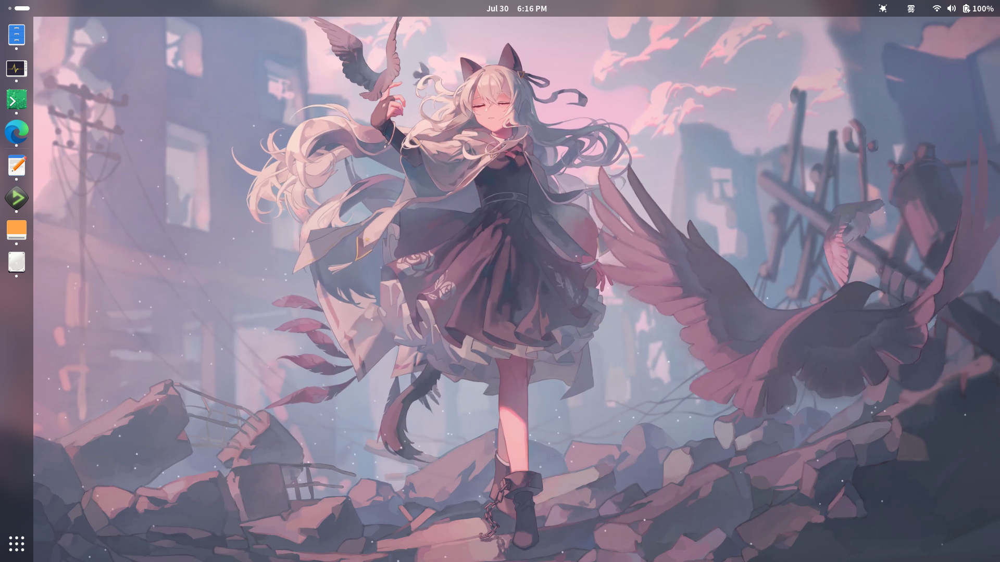
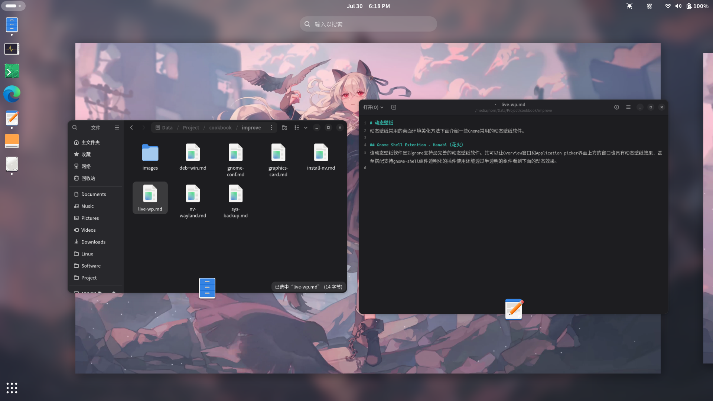
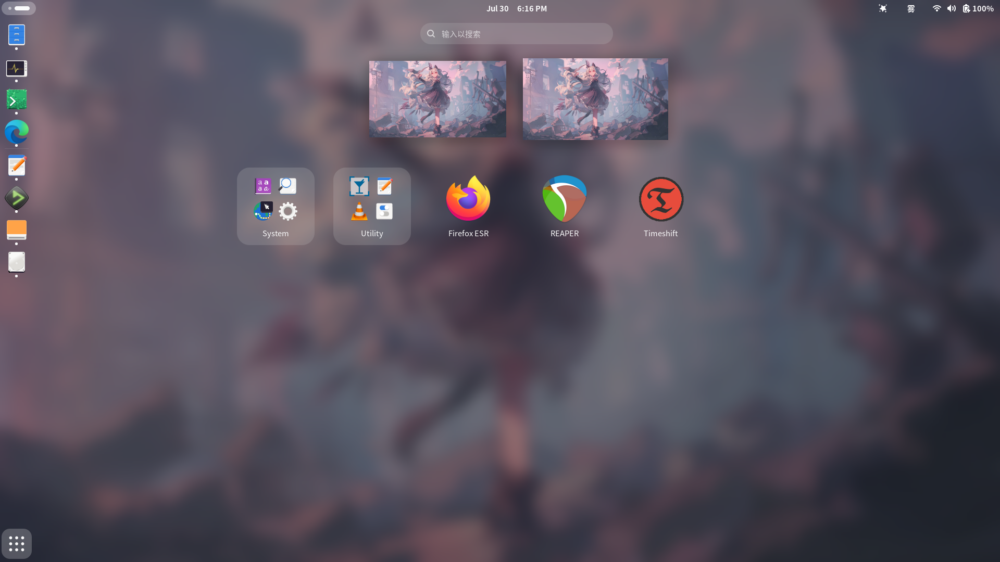

# 动态壁纸
动态壁纸是常用的桌面环境美化方法。下面介绍一些Gnome常用的动态壁纸软件。

## Gnome Shell Extention - Hanabi（花火）  
Hanabi是一个Gnome扩展，该动态壁纸软件是对gnome支持最完善的动态壁纸软件。其可以让Overview窗口和Application picker界面上方的窗口也具有动态壁纸效果，甚至搭配支持gnome-shell组件透明化的gnome扩展使用还能透过半透明的组件看到底下的动态效果。





Hanabi的安装方法如下：  

Gnome版本要求：>= 42  
预备工作，先通过以下命令安装Hanabi所需依赖：  
```sh
apt install meson libgtk-4-media-gstreamer
```
<br>

对于Gnome 45及更新版本直接下载[Hanabi的github仓库](https://github.com/jeffshee/gnome-ext-hanabi)中的master分支（请勿相信README中说的“Gnome 48下载gnome-48分支”的说法，该分支存在较明显的Bug），对于Gnome 44及之前版本则下载legacy分支（如果下载zip档则下载完后解压zip文件）。然后切换目录到Hanabi项目目录内，之后执行扩展安装命令`./run.sh install`。最后，重新登录gnome或重启计算机即可开启Hanabi扩展并在Hanabi扩展设置选择视频用作动态桌面。  

**注意事项1：** Hanabi仅支持将视频文件作为动态壁纸而不支持将流媒体、网页、图形程序用作动态壁纸。  
**注意事项2：** 如果你有独占使用ALSA音频系统的需求，请确保动态壁纸视频文件中不存在音频轨道，否则Hanabi将占用着音频设备导致需要ALSA的程序无法独占ALSA（即使已打开Hanabi设置中的静音开关）。  

**Hanabi + Dash to Dock + Blur my shell**  

如果将以上三个扩展一起使用而且Dash to Dock的透明效果由Blur my shell提供的话，将会导致进入Gnome桌面环境时Dash to Dock底下缺少动态壁纸效果，且其下方显示的是原来的静态壁纸。而如果Dash to Dock的透明效果由自己提供，则在概览和应用菜单中Dock两层效果叠加而导致Dock背景色较暗，界面看起来效果不统一。解决方法如下：  

该方法将会导致透明渲染管线只能使用高斯模糊效果（如果你追求各处透明效果和谐统一的话）。首先确保Dash to Dock的外观设置选项卡中自定义不透明度的选项为“默认”。然后将Blur my shell的Dash模糊类型设置为动态并且打开“在overview中禁用”开关以防重新Dash区域效果叠加的情况。  

如果要追求透明效果的和谐统一，则要将其它gnome-shell组件的模糊类型设为静态透明效果且管线设为“Default”（正常“Default”应该只有一个高斯模糊效果）（使用动态也不是不行，但会占用较多的计算机资源）。然后将Dash的模糊亮度设置成和“Defualt”管线的高斯模糊亮度一致，之后调节Dash的模糊强度至看起来和其他组件模糊强度一致（因为静态管线高斯模糊的强度映射曲线和动态高斯模糊的强度映射曲线是不一样的）。  

**注意：** Hanabi还存在一些小Bug（如：手动停止动态壁纸播放后锁屏并重新进入gnome后无法重新恢复动态壁纸的播放），虽然较少影响使用，笔者还是希望作者可以积极修复这些小bug。  

吐槽：为了找到这三个拓展一起使用造成的Bug的解决方案真的花了好长时间。一开始发现进入gnome（锁屏再登录进入也算）后Dash to Dock部分没有动态效果，后面研究出来可以通过重启Dash to Dock来使其底下正常显示动态壁纸效果，但是每次都手动操作明显不方便，也不想为了这碟醋而专门写个程序用来自动重启扩展。后来我发现所有Dash to Dock自带的透明化效果就没有问题了，但是在overview和app picker中两个插件的透明效果叠加将会导致Dash to Dock额外的黑（界面显得不统一很难看）。后来笔者机缘巧合下看了Blur my shell的README发现其中提了一句"static blur uses a static image of the wallpaper, and applies the effects that are part of a pipeline on it"（“静态模糊使用壁纸的静态图像，并且对其应用管线（部分）的效果”），然后README还提了一句"dynamic blur makes the component translucent, and blur directly what is behind it"（“动态模糊让组件半透明化，并直接模糊其背后的东西”），于是我猜测动态模糊可以根据其底下的图像实时更新其显示（但是，gnome-shell其他组件使用静态模糊也可以看到背后的动态壁纸效果呀，和readme中的描述不太对的上）。但我想：“不管了，死马当活马医算了。”，然后我单独将Dash的模糊类型改成动态模糊（并关闭了Dash to Dock自带的透明化效果）。然后发现成了，但是我发现在overview和app picker还是存在Dash叠加情况，后来我试了一下调节一些可疑的设置，然后发现开启“在overview中禁用”开关效果就没问题了。后面我又发现一些音频应用无法独占ALSA，然后经过我的一番分析和尝试也解决了该问题，见：上文的“注意事项2”。  

## Hidamari（向日葵）
[Hidamari](https://github.com/jeffshee/hidamari)与Hanabi是同一个作者开发的但Hidamari不是Gnome扩展而是一个独立的软件。Hidamari支持将本地视频、视频流和网页作为动态壁纸，但不支持图形程序。该软件的动态壁纸效果仅在桌面可见，在overview和app picker中则没有动态效果。且对于桌面透明组件的支持也没有Hanabi好。  

Hidamari的安装方法如下：  

预备工作，安装flatpak并配置远程flathub仓库（如果已经安装并配置好，请跳过本步骤）：  
```sh
sudo apt install flatpak
flatpak remote-add --if-not-exists flathub https://dl.flathub.org/repo/flathub.flatpakrepo
```

安装Hidamari的命令如下：  
```sh
flatpak install flathub io.github.jeffshee.Hidamari
```
安装完毕后可通过命令`flatpak run io.github.jeffshee.Hidamari`启动Hidamari或点击应用菜单中的对应图标启动Hidamari（如果安装完毕后应用菜单没有出现Hidamari的图标，则需重新登录桌面环境或重启计算机）。

## Komorebi（叶影斑驳）
注意：该动态壁纸软件已过时，其已停更多年且不支持Debian Trixie及更新系统。

安装方法如下：  
从该软件的[github发布页](https://github.com/christianloopp/komorebi/releases)下载deb包并通过以下命令安装：  
```sh
apt install KOMOREBI_PATH
```
注：`KOMOREBI_PATH`为Komorebi的deb包的路径，如果路径为相对路径则路径要以`./`开头。  

## 参考资料

\[1\] [gnome-ext-hanabi/README.md at master · jeffshee/gnome-ext-hanabi](https://github.com/jeffshee/gnome-ext-hanabi/blob/master/README.md)  
\[2\] [blur-my-shell/README.md at master · aunetx/blur-my-shell](https://github.com/aunetx/blur-my-shell/blob/master/README.md)  
\[3\] [Debian Flathub Setup | Flathub](https://flathub.org/setup/Debian)  
\[4\] [hidamari/README.md at master · jeffshee/hidamari](https://github.com/jeffshee/hidamari/blob/master/README.md)  

---
Author: smgdream | License: CC BY-NC-SA 4.0 | Version: 0.6.7 | Date: 2025-07-31
