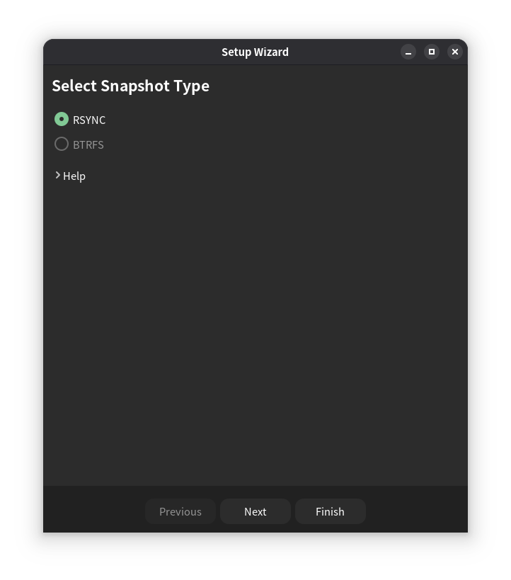
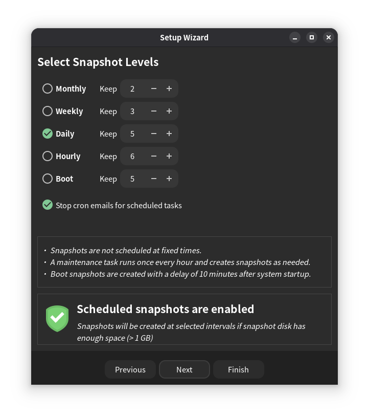
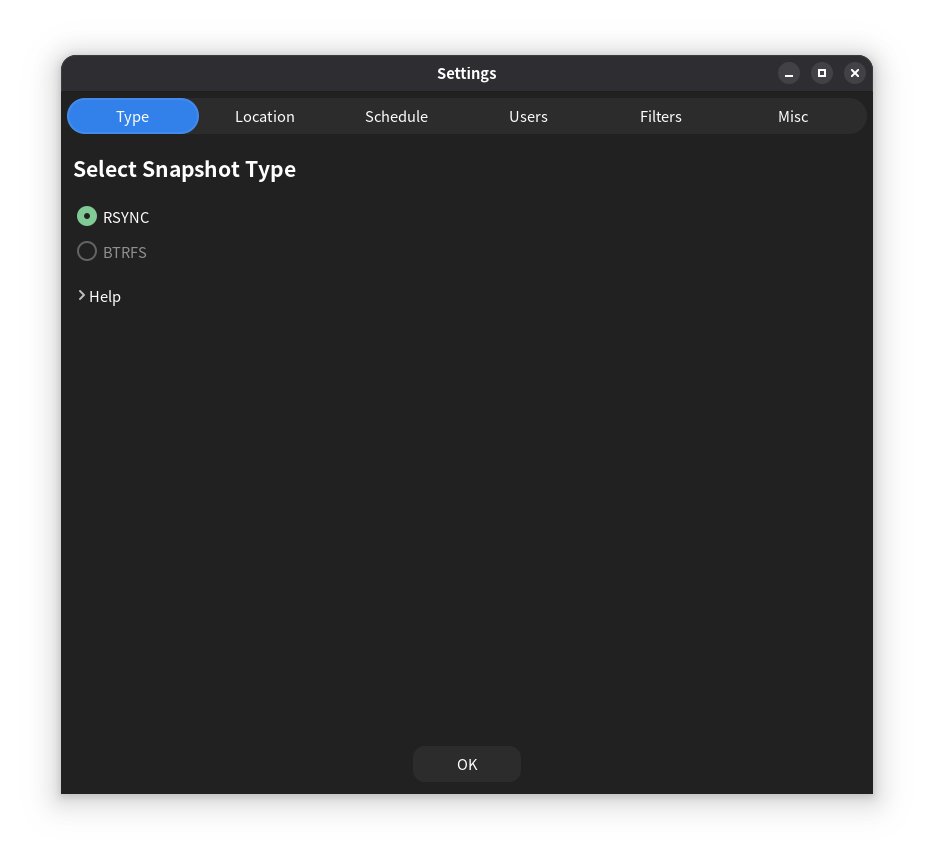

# Debian系统备份

虽然Debian以稳定著称，但还是有极小概率滚挂。而且有时候我们为了干一些事情而安装了一堆乱七八糟的软件还没法卸载干净。或者手动安装软件或手动调整系统文件导致系统出现问题且难以修复。这时如果有备份直接时光倒流回去就行了。所以通过备份，系统就多了一重保险。接下来笔者通过timeshift来说明如何备份Debian。  

**安装timeshift**  
通过以下命令安装timeshift：  
```sh
apt install timeshift
```
然后在应用菜单中点击timeshift并输入密码即可使用timeshift。  

**首次使用timeshift的配置**  
首次使用timeshift将会出现一个配置向导要求用户配置timeshift。  
首先选择一个备份方式，对于非Btrfs文件系统的用户来说只有RSYNC一个选择，而对于使用Btrfs文件系统的用户则可以选择RSYNC或BTRFS。  
  
然后选择备份的存放分区（不支持windows的文件系统）。  
  
之后设置计划备份，按照需求勾选需要的计划备份节奏，还可以进一步调整相应计划备份方式保存的备份数量，当然全部计划备份方式都不勾选仅使用手动备份也可以。（"Stop corn emails for schedulet tasks"选项用于设置“停止定时任务的邮件通知”）  
  
然后设置用户目录文件的选择与排除  
  
然后即可完成初始化配置。  
  

**手动备份**
  
点击主界面Create按钮并等待一段时间即可完成备份（初次备份所需时间稍长一些）。  

**恢复备份**  
在主界面中选中要恢复的备份并点击Restore按钮即可恢复备份（备份恢复完毕后将会自动重启计算机）。  

**删除备份**  
在主界面中选中要删除的备份并点击Delete按钮即可删除备份。  

**调整设置**  
点击Settings按钮即可调整备份设置。  
  
在Settings的Filters选项卡中可以设置备份时目录和文件的排除。  
  

<!-- 命令行备份与恢复 -->
---
Author: smgdream | License: CC BY-NC-SA 4.0 | Version: 0.6 | Date: 2025-07-25
