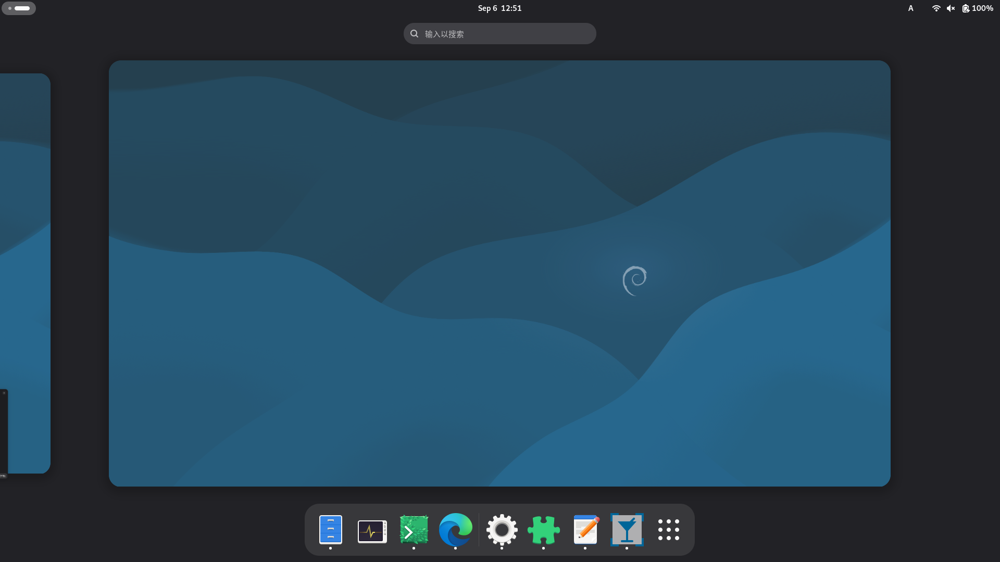

# 何为Debian

Debian是最古老的Linux发行版之一，其至今仍在积极更新。其是当Mint、Kali、Ubuntu等众多Linux发行版的上游。当前最新的Debian稳定版为Debian 13（代号：Trixie），Debian Trixie具有现代的用户界面，其支持许多现代硬件亦支持大量的软件。  
  

Debian既可用于日常使用、也能用于软硬件开发工作、还能用于服务器以提供网络相关服务。  

Debian使用dpkg作为低级包管理器，使用apt作为高级包管理器。  

---
Author: smgdream | License: CC BY-NC-SA 4.0 | Version: 0.2 | Date: 2025-09-06
