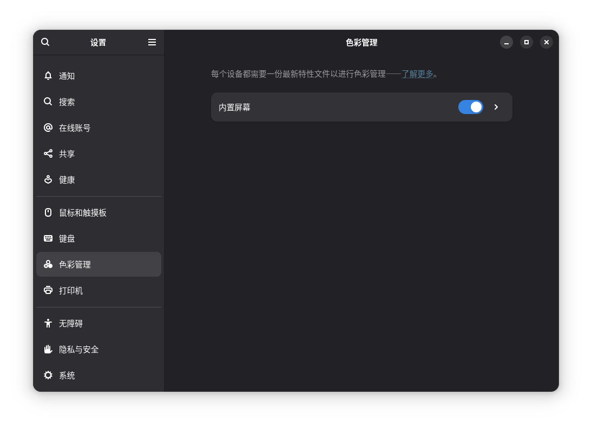
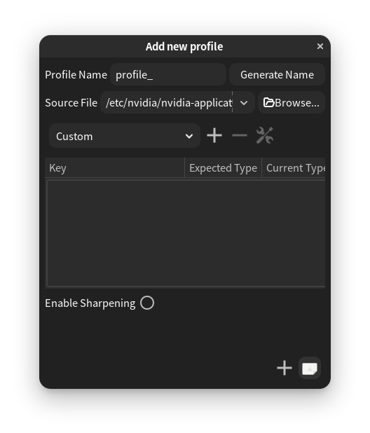

# Debian Trixie Bug报告

## 1. 部分环境中GTK4应用汉字渲染异常
问题描述：在100%显示缩放1.00字体缩放的前提下，gtk4应用中部分控件中部分汉字存在渲染异常的情况（如“色”字底下被截去，“最”字顶上被截去）。  
  
问题定位：经过本人、朋友及网友的努力，现已基本确定该bug来源于上游gtk4。  
修复状态：未修复  

## 2. 较差的NTFS文件系统支持
问题描述：Debian trixie的NTFS文件驱动由ntfs-3g更换为了ntfs3，当NTFS分区存在脏分区问题时ntfs3将拒绝挂载相应分区。  
问题定位：问题来自于ntfs3驱动对NTFS文件系统支持不够完善。  
缓兵之计：使用Windows或Windows PE的磁盘检查工具扫描并修复磁盘。  
修复状态：未处理  

吐槽：我估计该问题若想要解决估计要等到Microsoft什么时候心情大好把NTFS文件系统规范开源了才行（我估计在ReFS成为Windows的默认文件系统后才有可能）~~或者被来自霓虹的神秘黑客Barrel Titor攻破机构的服务器将机构的秘密公之于众后才行~~。  

## 3. 应用文件夹偶尔无法正常关闭
问题描述：偶尔会遇到gnome应用文件夹无法通过点击应用文件夹外的空白区域关闭（除了dock栏和顶栏）。  
问题定位：在Manjaro中也存在相似情况，故推测该bug源自于上游。  
修复状态：已修复

## 4. 部分应用内少数图标缺失
问题描述：部分应用内的图标依赖于系统中安装的图标，而应用里的部分图标在系统图标库中没有对应图标，导致显示"image-missing"图标。  
  
修复状态：未修复

## 5. 部分图形界面程序关闭时会稍微卡顿
问题描述：部分图形界面程序有时关闭时会稍微卡顿，如: Ptyxis。  
修复状态：未修复  

---
License: CC0 | Version: 0.7.1 | Date: 2025-10-24
