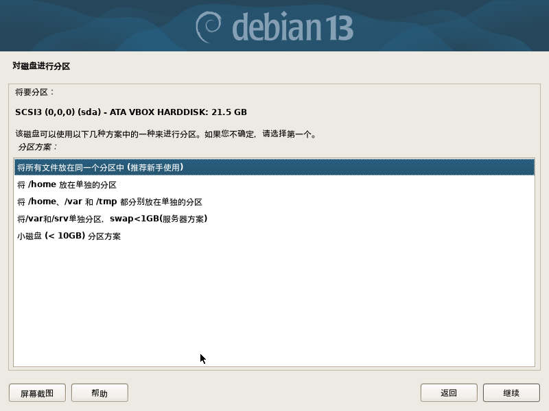
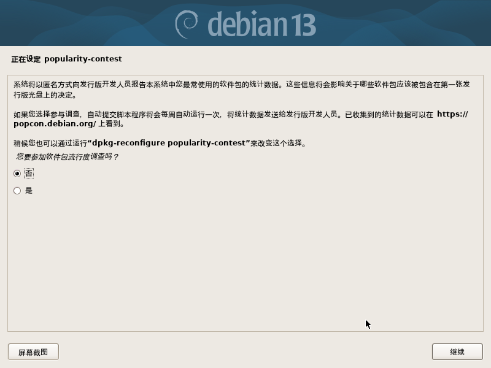
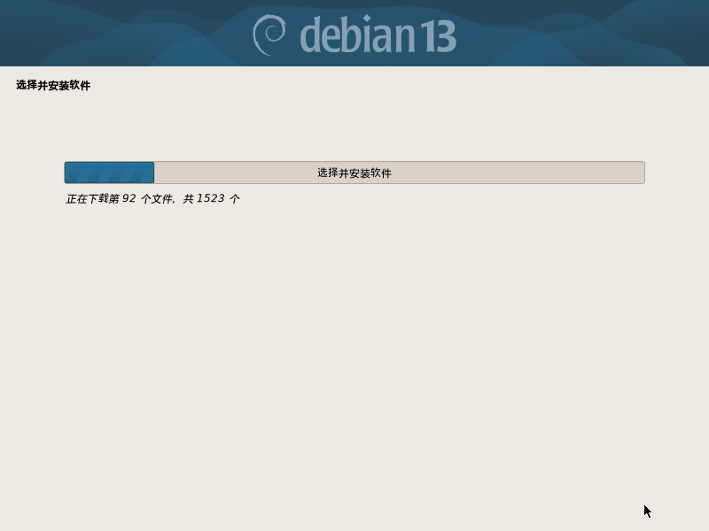

# 安装Debian

以下内容基于Debian Trixie（常规离线映像）展开，其他版本的安装方法可能有所有出入。  
## 1. 下载ISO映像
Debian提供了各种ISO安装镜像类型，其中CD版均为网络安装镜像安装过程依赖于网络连接。DVD版可用于离线安装Debian其包含了常用软件、常用桌面环境及常用图形界面程序。BD版亦可用于离线安装debian，其包含了常用桌面环境、常用图形界面程序及大量常用软件（注：以上描述仅限于只有Disk1的情况，如果下载了所有镜像集合则可以离线安装官方软件集中的大部分软件）。  

Debian提供了三种下载ISO映像的方式：常规下载、Bittorrent种子和jigdo。常规下载方式可通过浏览器或下载器直接下载链接所定位的ISO文件，下载速度易受到多方面的影响。BT种子需通过BT客户端下载，下载体验较好。jigdo需通过jigdo客户端下载，下载速度可能不稳定但这是下载完整ISO集合的唯一方法（注：本文不对jigdo下载进行讨论，有相关需求者自行查看[相应官方资料](https://www.debian.org/CD/jigdo-cd/)）。  

笔者建议优先采用Bittorrent方式下载iso映像文件，既可获得良好的下载体验，也可以减轻官方服务器的压力，还可以提升他人的下载体验（常用Bittorrent客户端：qBittorrent，aria2, motrix）。如果使用常规方式进行下载，选择离当前地区较近的服务器可获得相对好一些的下载体验。  

### 快速链接
[Debian 下载页](https://www.debian.org/distrib/)  
[Debian 测试版下载页](https://www.debian.org/devel/debian-installer/)  
[官方Debian trixie DVD ISO映像种子下载页面](https://cdimage.debian.org/debian-cd/current/amd64/bt-dvd/)  
[官方Debian trixie DVD ISO映像下载页面](https://cdimage.debian.org/debian-cd/current/amd64/iso-dvd/)  
[兰州大学镜像站Debian trixie DVD ISO镜像下载页面](https://mirror.lzu.edu.cn/debian-cd/current/amd64/iso-dvd/)  

后续内容主要围绕dvd disk1展开。  

## 烧录镜像
### Linux
刻录到光碟  
```sh
apt install dvd+rw-tools
growisofs -dvd-compat -speed=8 -Z /dev/cdrom=debian.iso
```
刻录到U盘（注意！以下命令将会清空U盘所有数据）  
```sh
dd if=debian.iso of=/dev/TARGET_DEV_NAME
```
### Windows
通过UltarISO或其他刻录软件iso映像刻录到光碟。  
通过Rufus或其他U盘烧录软件将iso映像烧录到U盘。  

## 关闭安全启动和TPM（可选）
安装和使用linux建议关闭安全启动和TPM（虽然linux系统支持安全启动和TPM），这是因为开启这两个功能将会导致部分linux系统的设置变得复杂，而且这两个功能在大部分情况下防己不防人。在关闭这两个功能之前需要在windows的设置中关闭磁盘的BitLocker功能。然后关闭计算机再启动计算机并通过快捷键进入UEFI设置菜单，之后找到并关闭这两个功能。最后按F10保存设置并重启计算机。  

## 启动安装程序
请确保计算机已处于关机状态。  
插入安装媒介，启动计算机，通过启动项选择或BIOS设置选择安装媒介作为启动引导设备以启动安装程序（[电脑开机启动项快捷键参考](https://www.cnblogs.com/idreamo/p/10495343.html)）。进入grub菜单后选择Graphical install（图形化安装）或Install（TUI模式安装）。这两种安装方式大同小异，只是操控方式略有不同（在grub中还存在Advanced options（高级选项）选项，在其子菜单中还提供了专家模式和自动安装选项，本文不对其进行讨论）。下文以图形化安装来讲解安装过程。  

注：图形化安装程序可能存在bug，使用TUI模式安装可以尽量避免安装程序的bug。  

## 设定语言及键盘映射
自此正式开始安装过程，笔者建议安装过程全程断网，中途可能遇到的部分问题在“问题处理”段落提供了解决方案。  
**选择语言** 选择一个合适的语言，如：中文(简体)（该语言既是安装界面的语言也是系统语言）  
  
然后 **选择地区** 选择一个合适的地区，如：中国（该地区将决定与地区相关的数据显示格式，如：时间格式）  
  
之后 **配置键盘** 选择一个合适的键盘布局，如：美式键盘（国内最常用的是美式键盘，其次是英式键盘。美式键盘的enter键为长方形，英式键盘的enter键为一个大大的阶梯形）  
  

## 加载安装程序组件
安装程序会自动**检测并挂载安装介质**，然后自动**从安装介质中加载安装程序的组件**  
    
  

## 配置网络
安装程序会自动**配置网络**，**探测网络硬件**，如果存在多个网络设备则会让用户选择主网络接口，通常选择有线网络设备（除非不存在有线网络设备）。  
  
然后安装程序会继续自动配置网络（此时可以选择“取消”跳过该过程）。  
  
之后将会提示网络配置失败（不用在意该警告继续即可）。  
  
然后安装程序将会询问是否要重新配置网络，选择“暂时不配置网络”。  
  
然后设置一个合适的主机名（如果不清楚默认即可）。  
  

## 设置用户和密码
为root用户设置密码（root用户是Linux中最高权限的用户，务必设置一个高强度的密码并保管好该密码）。  
  
之后开始创建一个普通用户（该用户为平常使用的用户），首先设置用户的全名。  
  
然后设置该用户的用户名，用户名默认等同于全名，如有需要请修改用户名（全名和用户名的关系类似于花名和真名的关系）。  
  
最后，设置该用户的密码。  
  
在这之后安装程序将会尝试配置时钟，如果已连接网络将会通过NTP联网配置时钟（但是在之前的步骤中我们并没有选择联网）  
  

## 磁盘分区
**分区向导** 将会让用户选择分区方法，对于新手来说选择“使用整个磁盘”是最省事且简单的分区方法（注意：使用整个磁盘将会清除磁盘上的所有数据）。对于部分因为某些原因无法选择“使用整个磁盘”用户和有高级分区需求的用户则需选择“手动”分区（此处暂时不讨论手动分区，有相关需求者可参考后文“手动分区”段落）。下文将基于选择“使用整个磁盘”进行讨论。  
  
然后选择要分区的磁盘。  
  
之后选择分区方案，通常选择“将所有文件放在一个分区中”或“将/home放在单独的分区”，在此笔者选择“将/home放在单独的分区”。  
  
然后，通常双击“完成分区存在并将修改写入磁盘”以确认使用当前分区方案即可。  
  
之后安装程序将会列出分区信息列表并要求用户确认分区方案，通常选择“是”然后“继续”以执行分区操作。
  
最后安装程序自动执行分区命令以完成分区操作。

## 安装系统
安装程序将自动**安装基本系统**  
  
然后安装程序将**配置包管理器**并询问是否扫描额外的安装介质，如果你下载的是多ISO映像集合，则插入烧录了其他ISO映像的安装介质并选择“是”，如果仅有Disk1则选择否并，然后“继续”（因为当前仅有Disk1，所以选择“否”并“继续”）。  
  
之后安装程序将询问是否使用网络镜像站点，通常选择“否”（至于软件的更新和额外软件的安装则在安装完Debian后再进行安装和更新）。
  
然后安装程序将会更新软件信息并询问是否参与软件包流行度调查，“是”或“否”看个人意愿。
  
然后安装程序将会再次更新软件信息并要求用户选择额外的软件集合。
  
通常保持标准系统工具的勾选状态。如果需要安装web服务或ssh服务则需勾选对应选项。  
如果需要安装图像桌面环境则需勾选“Debian桌面环境”并勾选想要的桌面环境（如果仅勾选“Debian桌面环境”，则默认安装GNOME）（实际的桌面环境相关的勾选关系较为混乱，以上说明已经本人简化），笔者用惯了GNOME也用得很舒服，所以笔者选择GNOME桌面（如果不清楚如何选择，保持安装程序默认的“Debian桌面环境 + GNOME + 标准系统工具”勾选即可）。  
之后安装程序将会安装刚才指定的软件集合。  
  

## 完成安装
安装程序将会自动安装引导程序（在专家模式中可以选择引导程序，普通模式则为grub2）。  
  
然后自动进行最后的软件安装和配置。  
  
之后取出安装介质并点击继续。  
  
最后，安装程序将会进行收尾工作并重启计算机完成Debian的安装。  
  

## 启动到Debian
请确保Debian在BIOS启动顺序表中为第一启动项，否则通过BIOS设置其为第一启动项或通过启动项选择快捷键启动Debian。
然后进入grub菜单后等待5秒或直接回车即可进入Debian。
  
  
之后输入密码登录即可进入桌面。
  
注：第一次启动Debian桌面将会出现一个导览窗口，关闭或跳过即可（当然看看也行）。  
实际上，自此Debian已经安装完毕。但为了处理一点小问题，以及为了得到更好的体验，建议对系统的部分配置进行微调。

<!-- 光碟安装源注释？ -->
## 系统微调（可选）
### root用户语言设置
root用户下无法正常显示ASCII字符以外的字符，这是因为root用户的默认语言为`C`所致。  
手动将`/root/.profile`中的`LANG`和`LANGUAGE`变量对应的值从`C`更改为`C.UTF-8`。  

### 对当前用户启用sudo
只有在sudo用户组中的用户才可以使用sudo命令，而Debian安装程序不会将其创建的普通用户添加到sudo用户组（除非安装Debian时没有设置root密码）。  
以root用户执行`usermod -a -G sudo USER_NAME`，然后彻底登出用户或重启计算机。  

### 允许普通用户执行更多命令
在/sbin目录中的命令普通用户无法直接执行即使普通用户拥有执行权限且命令非特权命令，如：`reboot`。这是因为普通用户的默认PATH中没有/sbin。  
编辑`/etc/profile`将普通用户的`PATH`变量对应的值的末尾添加上`:/sbin`，然后彻底登出用户或重启计算机。  

## 手动分区
手动分区的主界面如下  
  
双击设备名条目可以创建新的空白分区表（创建空白分区表时可能会询问分区表类型，对于使用UEFI引导的机器则选择gpt分区表）。双击空闲空间可以创建新分区。双击已有分区可以设置该分区。  

**创建新分区**  
双击空闲空间然后选择创建新分区之后输入分区大小，在这之后如果分区大小不足以填满空闲分区则还需要设置分区位置，然后将会进入分区设置界面。  

**分区设置**  
分区设置界面如下  

“用于”条目可设置该分区的文件系统（注意：不同的文件系统可设置的条目会有所区别。鉴于目前各文件系统的情况<sup>注1</sup>建议分区使用Ext4或XFS文件系统，数据分区还可以使用ZFS）。“挂载点”条目可设置当前分区的挂载点。“挂载选项”可设置分区的挂载属性。“可启动标志”用于设置该分区是否为启动分区（采用UEFI引导方式的计算机启动分区是挂载点为/boot/efi的分区，而采用BIOS引导方式的计算机的启动分区为/boot所在分区）。  

**基本分区说明**  
10年后生产的计算机基本上都支持UEFI启动，而支持UEFI启动的操作系统通常要有两个分区：EFI引导分区和根目录所在分区。在分区的时候需要将磁盘的第一个分区用作EFI引导分区，其文件系统设为EFI系统分区并开启“可启动标志”（该分区大小通常为几百MB，安装程序将自动把该分区的挂载点设为`/boot/efi`）。另外还需要创建一个合适大小的分区作为根目录所在分区，其挂载点为`/`，该分区不需要启用“可启动标志”。如果还需要更复杂的分区安排，请在此基础之上自行研究规划。关于多系统共存见：[Debian+windows](../improve/deb+win.md)  

注1: “情况”指该文件系统的稳定性和现代文件系统特性支持，及其在社区中的被支持被认可的情况。  

## 无移动介质安装Debian
注意：无移动介质安装Debian有可能安装失败，如果条件允许的话还是尽量使用移动介质安装Debian。  

在用分区工具在本地磁盘上划分出一个不小于5GB的空间并将其格式化为fat32格式，然后将ISO映像内的所有文件复制到该分区中。然后还需要添加UEFI启动项。  
在linux中通过以下命令添加启动项。  
```sh
apt install efibootmgr
efibootmgr -c -d /dev/DEVICE_NAME -p N -L "Debian Installer" -l "\EFI\boot\bootx64.efi"
```
注：`DEVICE_NAME`为硬盘设备名而非分区设备名，`N`为分区编号（即安装文件所在分区的序号，从1开始数）。  
在windows中通过BOOTICE的“UEFI->修改启动序列”菜单将安装文件所在分区下的\EFI\boot\bootx64.efi添加到启动菜单中，然后保存设置。  

最后，重启计算机选择好启动项后即可开始安装debian。  

## 问题处理
### 无法挂载安装介质
有时候会出现无法挂载安装介质的情况，这时候需要手动挂载安装介质。  
通过ctrl+alt+Fx快捷键切换到一个没有任务的tty中，然后再执行以下命令挂载安装介质。  
```sh
mount /dev/INSTALLATION_MEDIA_PARTITION_DEVICE_NAME /cdrom
```
注：`INSTALLATION_MEDIA_PARTITION_DEVICE_NAME`为安装介质分区设备名  
然后返回安装程序所在tty并重新检测安装介质，即可继续安装进程。  

## 参考资料

\[1\] [Debian GNU/Linux Installation Guide](https://www.debian.org/releases/stable/amd64/install.en.pdf)  
\[2\] [sudo - Debian Wiki](https://wiki.debian.org/sudo)  

---
Author: smgdream | License: CC BY-NC-SA 4.0 | Version: 0.9.6 | Date: 2025-09-05
