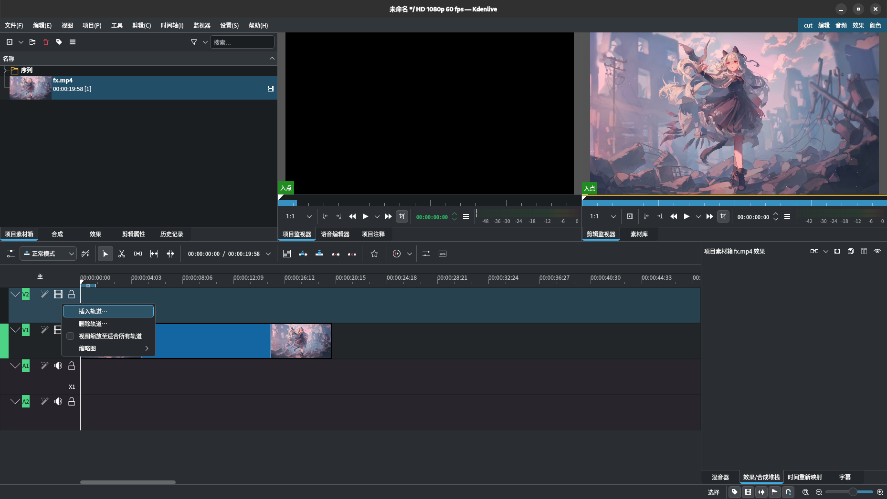
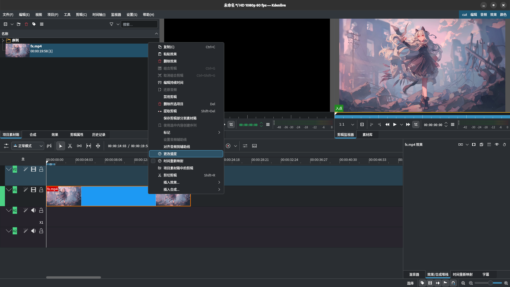
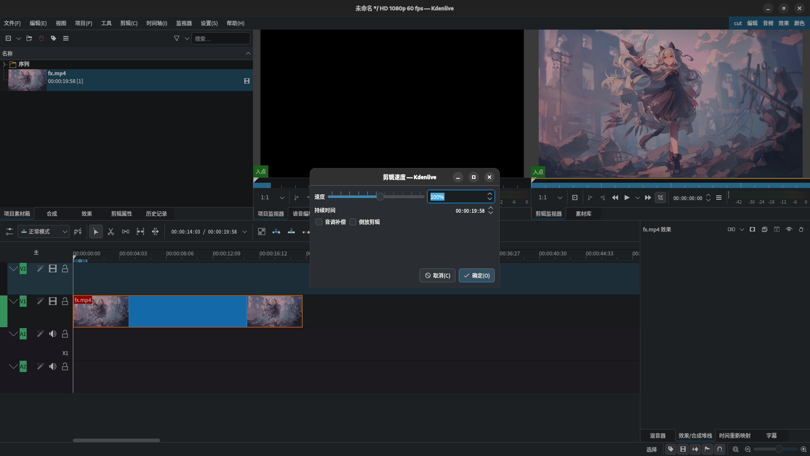
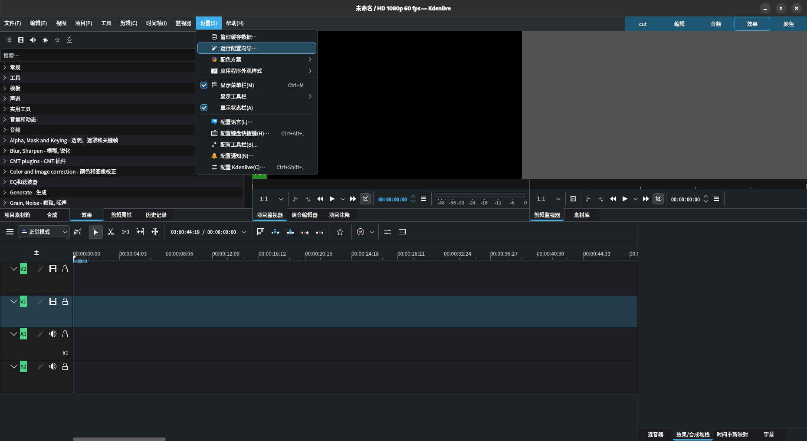
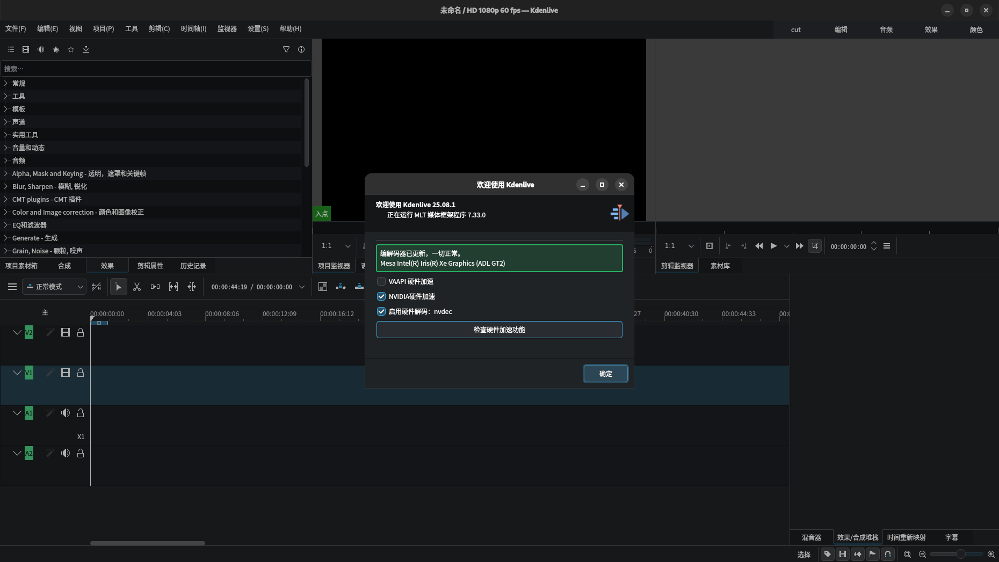
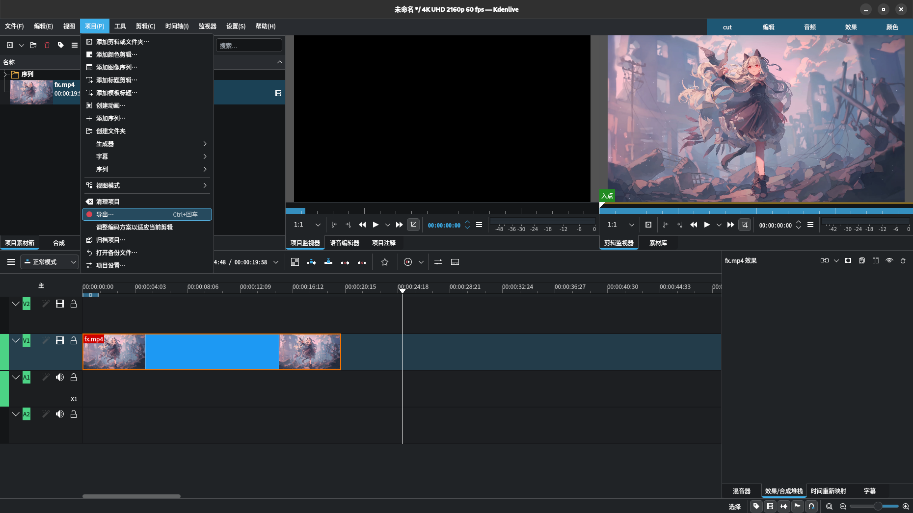
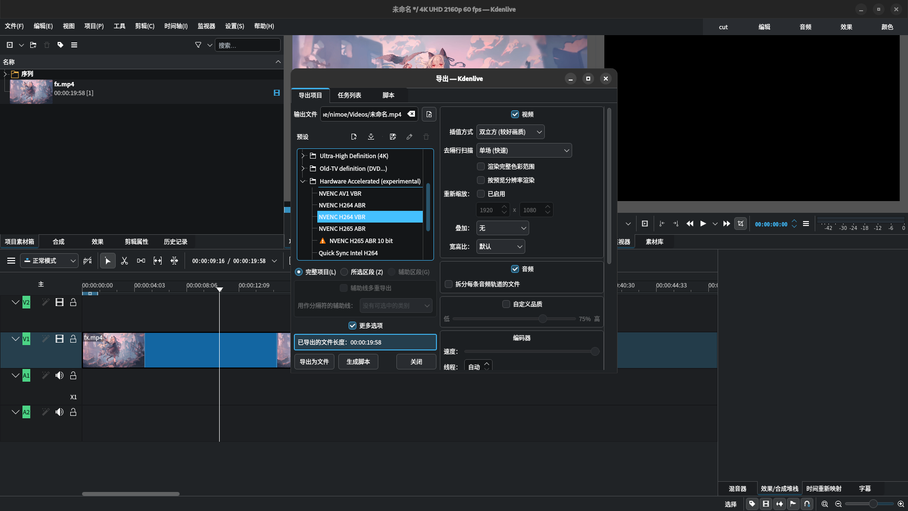
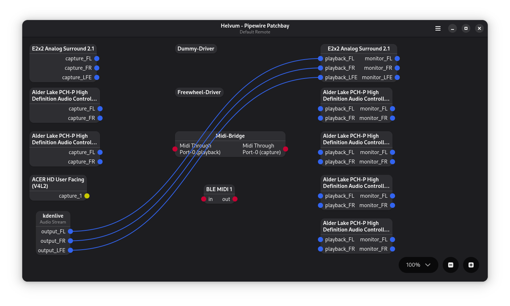

# 其他软件使用说明

## Kdenlive
Kdenlive是一个开源的功能较为完善的非线性视频编辑软件。其UI界面使用了QT框架。  

**注意事项**  
Kdenlive没有项目导览界面，在开始对项目的操作之前务必确保已将项目参数设置为所需的参数。可在 *项目->项目设置* 中更改当前项目的参数，亦可在 *设置->配置Kdenlive->项目默认值* 菜单中设置默认项目参数。  

### 新建轨道
右键任意轨道的轨道头即可新建相应类型（视频/音频）的新轨道。  
  

### 加速单个剪辑
右键剪辑片段点击 *更改速度* 即可调整相应剪辑片段的速度,也可以按住`Ctrl`并拖动剪辑片段边缘来更改速度。  
  
  

### 硬件渲染导出
在第一次使用Kdenlive前点击*设置->运行配置向导*，然后点击*检查硬件加速功能*再点击*确定*即可完成硬件加速功能的配置。  
  
  

在渲染导出影片时，点击*项目->导出*，然后选择Hardware Accelerated (experimental)预设组中当前硬件所支持的编码预设即可通过硬件渲染导出影片。  
  
  

## REAPER

### 隐藏空白TCP区域的插入轨道按钮

隐藏从7.46开始出现的空白TCP区域显示的插入轨道按钮的方法：  

右键Toolbar空白区域->Customize toolbar->下拉菜单中选择Empty TCP area toolbar->移除Customized toolbar中的Insert track->OK

## Helvum
Helvum是由pipewire团队开发的pipewire音频路由设置工具。  
  

### 建立音频连接
从应用的输出端点拉出一根线并拉到音频设备的输入端点即可建立音频连接。  

### 断开音频连接
在已有线路的一端拉到另一端即可断开当前线路的音频连接。  

## DeaDBeeF

### 通过ALSA输出播放mp3音频
使用ALSA输出方式可能无法播放mp3文件，问题的解决方式如下：  

在*偏好设置->采样精度中*指定采样精度，对于板载声卡及中低端专业声卡通常设置为24bit，对于部分HIFI声卡及高端专业声卡根据声卡本身采样率支持情况可以将采样率设置为32bit。

### 调整布局
勾选*查看->设计模式*，然后右键用户界面即可更改控件或调整布局。  

### 安装插件
将插件的共享库文件复制到DeaDBeeF安装目录下的`lib/deadbeef`目录中即完成插件的安装。  

## 参考资料
\[1\] [Adding Tracks — Timeline — Kdenlive Manual 25.04 documentation](https://docs.kdenlive.org/en/user_interface/timeline.html#adding-tracks)  
\[2\] [Change Speed of a Clip — Editing — Kdenlive Manual 25.04 documentation](https://docs.kdenlive.org/en/cutting_and_assembling/editing.html#change-speed-of-a-clip)  
\[3\] [Change speed — Right-Click Menus — Kdenlive Manual 25.04 documentation](https://docs.kdenlive.org/en/cutting_and_assembling/right_click_menu.html#change-speed)  
\[4\] [ddb_waveform_seekbar/README.md at master · cboxdoerfer/ddb_waveform_seekbar](https://github.com/cboxdoerfer/ddb_waveform_seekbar/blob/master/README.md)  
\[5\] [REAPER | Old Versions](https://www.reaper.fm/download-old.php?ver=7x)  

---
Author: smgdream | License: CC BY-NC-SA 4.0 | Version: 0.6.3 | Date: 2025-10-17
