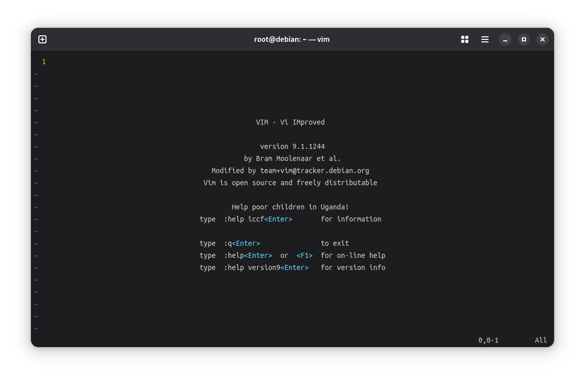
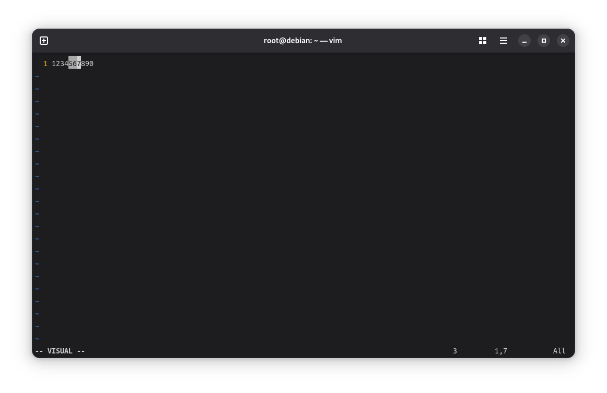
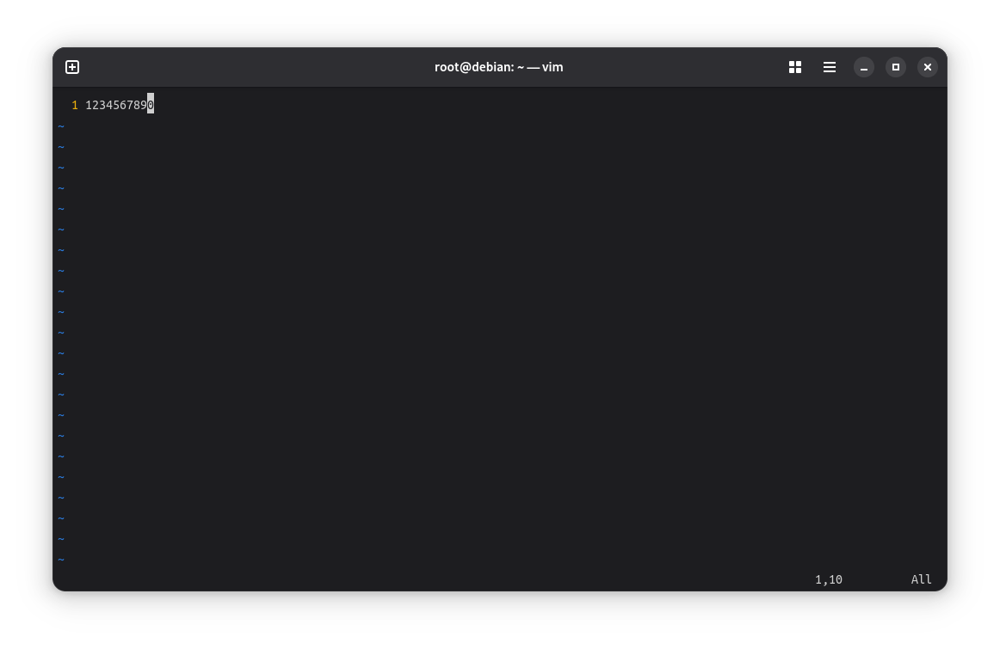
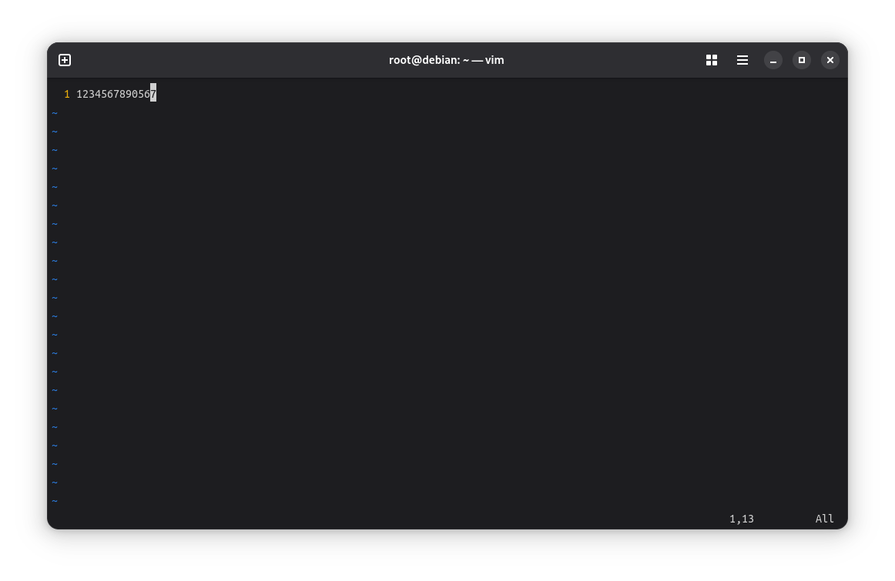

# 无法退出的VIM

vim是一个在linux世界经常被使用的IDE。 ~~但众所周知，一旦启动vim后就没有人能退出vim了。不过我们应当庆幸vim不是一个通过脑机接口进行交互的游戏。~~ 当然任何退出vim这个问题确实困扰了许多人。那如何退出vim呢？  

启动vim后用户将会看到类似下图的界面。  
  
要退出vim，首先需要按下`Esc`，然后输入`:q`，最后回车即可退出vim。我们成功退出vim了，但为什么要这样退出呢，vim的操作逻辑又是怎么样的呢？下面让我们来简单学习一下vim的操作逻辑与基本操作方法。  

**注意：** 本文虽然是简单的vim教程但并非是急速速成vim文本编辑教程。如果你只是想要了解最简单的vim文本编辑，那本文不太适合你，请另寻他处。  

## VIM简要教程

Vim有三个主要模式  

**Normal Mode**  
常规模式，启动vim或通过vim打开文件后默认处于该模式。例如复制、粘贴、删除、保存、退出等许多常用操作均在该模式进行，这些操作被称之为“命令”(command)，而在该模式下键盘的键入将被识别为命令而非输入的内容。  

**Insert Mode**  
插入模式，该模式用于进行基本的文本编写，无法执行复制粘贴等操作。该模式可通过在常规模式通过命令`i`（插入）或命令`a`（追加）进入该模式，在该模式下键盘的键入才是输入内容。  

**Visual Mode**  
可视模式，在可视模式下可以选择一段文本并对其执行操作。  

```
+----------+             v           +----------+  i or a   +----------+
|          | <---------------------- |          | --------> |          |
|  Visual  |                         |  Normal  |           |  Insert  |
|          | ----------------------> |          | <-------- |          |
+----------+  v或选择文本并执行操作  +----------+    esc    +----------+
```
模式切换状态机示意图  

### 插入模式
在常规模式中键入`i`或`a`即可进入插入模式（i为在光标所在处开始编辑，a为在光标所在处后开始编辑）。在插入模式中可直接键入内容、通过回车换行、Backspace逐字删除，通过方向键可以移动光标。当前键入完毕后可通过`Esc`返回常规模式。  

### 常规模式
在常规模式中可以通过hjkl或上下左右方向键移动光标。  
```
     ^
     k
< h     l >
     j
     v
```
**command-line mode**  
常规模式有一个子模式被称为command-line（底行模式/命令行模式），当在常规模式中键入`:`时进入底行模式，然后输入要执行的命令，最后通过回车执行命令并自动返回常规模式。（该模式也可以描述为：部分命令略为复杂，需要成行键入并回车确认执行，这些成行执行的命令绝大部分以`:`开头。下面涉及到底行模式的内容均使用这种描述方式说明）。  

一些常用的操作需要在底行模式中执行，见下：  
| 命令 | 描述 |
| --- | --- |
| `:w`  | 保存文件 |
| `:w FILE`  | 另存为文件FILE |
| `:q`  | 退出vim |
| `:q!` | 强制退出vim（不保存退出） |
| `:wq`或`:x` | 保存并退出 |
| `:new`  | 新建文件 |
| `:new FILE`  | 新建文件并指定文件名为FILE |
| `:e FILE`  | 打开文件FILE  |
| `:%s/stringa/stringb/g`  | 将文件中的stringa替换为stringb（正则表达式） |
| `/word` | 向下查找内容word（这是极少数在不以冒号开头的底行命令，配合常规模式的命令`n`可不断向下查找word，命令`N`则不断向上查找word） |


**说回正常的常规模式** ，在常规模式中`^`可以将光标移动至行首，`$`可以将光标移动至行尾，`gg`可以将光标移动至首行的行首（部分操作由多个键入触发，需要按照顺序逐字键入，如`gg`表示按两下g，`13j`表示分别键入`1`、`3`、`j`该命名用于将光标向下移动13行），`G`可以将光标移动至尾行行首（注意：所有键入均区分大小写，同一个字母的大小写会触发不同的操作）。  

在常规模式中可以进行许多操作。`dd`用于剪切光标所在行（如果后续不粘贴则该操作等同于删除）。`yy`用于复制光标所在行。`p`用于在光标后粘贴刚才在vim中复制的文本（但如果文本是通过`yy`复制或`dd`剪切的文本行则将文本行粘贴到下一行）。`u`用于撤销（undo）之前的操作，等同于其他软件的Ctrl+z，同样多次使用`u`也可以撤销多个操作。`Ctrl+r`用于恢复（redo），即撤销撤销，其一样可以连续多次使用。`.`用于重复上一个操作。  

### 可视模式
在常规模式中通过`v`进入可视模式，如果再按`v`可直接返回常规模式，在可视模式中执行完操作后将自动返回常规模式。在可视模式中可以通过移动光标来选择一段文本，然后按下相应的键执行所需操作。`y`可用于复制所选文本。`d`可用于剪切所选文本（如果后续不粘贴则该操作等同于删除）。  

例如，当前我们需要复制粘贴一段文本。首先我们要在常规模式下将光标移动到我们所要复制的文段的第一个字符处，然后按`v`进入可视模式，之后移动光标至文段的最后一个字符并按下`y`复制所需文段（然后将自动返回常规模式），最后将光标移动至粘贴位置并按下`p`粘贴。  
  
  
  
  
  

### 示例：简单文件编辑
在终端中通过`vim FILE`打开文件，然后键入`i`进入插入模式，然后就可以正常编辑文本了。如果需要中途保存文件则按下`Esc`返回常规模式，然后输入命令`:w`并回车保存文件，然后再键入`i`回到插入模式继续编辑文件。最后如果需要保存退出则先按下`Esc`返回常规模式，然后输入命令`:wq`或`:x`保存退出（如果仅需退出则输入命令`:q`，如果需要不保存强制退出则输入命令`:q!`）。  

## vim窗口与标签页
在单个窗口中使用vim并不方便，通过使用vim的窗口和标签页功能，我们可以更加高效地编辑文本。  

### 窗口的创建
`:split`命令可以将当前光标所在窗口水平分割出来一个空白窗口，`:vsplit`命令可以将当前光标所在窗口垂直分割出来一个空白窗口。通过`:split FILENAME`或`:vsplit FILENAME`即可在分割出来的窗口中打开文件。  
`:new`命令可以用于创建水平新窗口，`:vnew`命令可以用于创建垂直新窗口。  

### 窗口的跳转移动与大小调整

**窗口的跳转**  
`CTRL-W w`命令可以在各窗口之间轮流跳转（`CTRL-W w`表示按下`CTRL`和`W`组合键然后都松开再按下`w`，其他与这种结构相似的命令的触发方式也与其相似，注意：按完组合键之后再按的那个键是区分大小写的）。  

`CTRL-W h`命令将跳转到左边的窗口。  
`CTRL-W j`命令将跳转到下边的窗口。  
`CTRL-W k`命令将跳转到上边的窗口。  
`CTRL-W l`命令将跳转到右边的窗口。  
`CTRL-W t`命令将跳转到顶部的窗口。  
`CTRL-W b`命令将跳转到底部的窗口。  

**窗口的移动**  
`CTRL-W H`命令将窗口移动到左边。  
`CTRL-W J`命令将窗口移动到下边。  
`CTRL-W K`命令将窗口移动到上边。  
`CTRL-W L`命令将窗口移动到右边。  
注意：“移动到某边”和“向某边移动”是不一样的。

**窗口的大小调整**  
`CTRL-W +`命令将扩大窗口。  
`CTRL-W -`命令将收缩窗口。  


### 标签页的创建
`:tabnew`可以用来创建新的空白标签页，`:tabnew FILENAME`用于创建新的空白标签页并指定新文件的文件名。  

`:tabedit FILENAME`用于在新标签页中打开指定文件。  

### 标签页的跳转
通过`gt`或`CTRL-PageDown`可跳转至下一标签页。  
通过`gT`或`CTRL-PageUp`可跳转至上一标签页。  

## 其他vim学习资料
本文仅说明了基本的vim使用逻辑及使用方法，下面提供了一些学习资料用以进一步学习vim。  

**vim本地学习资料:**  
官方vim基础教程：执行命令`vimtotur`  
vim官方帮助文件：进入vim后执行命令`:help`  

注：官方帮助文件中存在许多超链接，将光标移动到超链接上后通过命令`CTRL-]`即可跳转，通过`CTRL-O`即可回跳（可多次回跳，你想回跳3000次也可以，只要你受得了）。

**在线资料:**  
菜鸟教程 - vim：https://www.runoob.com/linux/linux-vim.html  
Vim中文用户手册：http://github.com/yianwillis/vimcdoc  
Vim使用全指南：https://segmentfault.com/a/1190000038702606  
Learn Vim: https://learnvim.irian.to/  
Vim Adventures: https://vim-adventures.com/  

## 参考资料

\[1\] vimtotur  
\[2\] vim :help  
\[3\] [Linux vi/vim | 菜鸟教程](https://www.runoob.com/linux/linux-vim.html)  
\[4\] [cheat sheet, minimalism, Linux, simple background, vim | 2560x1180 Wallpaper](https://wallhaven.cc/w/m9y289)  
\[5\] Practical Vim: Edit Text at the Speed of Thought Second Edition  
\[6\] [VIM学习笔记 多标签页（Tabs）](https://zhuanlan.zhihu.com/p/25946307)  
\[7\] [Vim中文用户手册](http://github.com/yianwillis/vimcdoc)  

---
Author: smgdream | License: CC BY-NC-SA 4.0 | Version: 0.7 | Date: 2025-10-13
